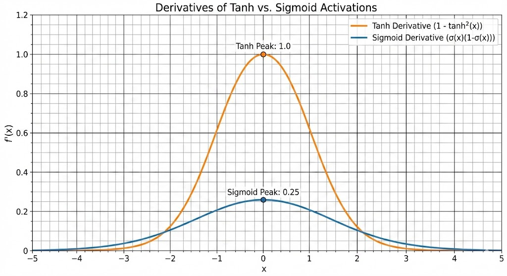

# Week 1 — Deep Learning Foundations

# 1. Tensors and Shape Thinking

In Deep Learning (DL), mastering "shape thinking" is arguably more important than memorizing calculus. If you can track the shapes of your tensors, you can usually build the architecture.

## 1.1 What a tensor is (in DL terms, not textbook terms)


Forget the physics definition ("an object that transforms according to..."). In Deep Learning, a **Tensor** is simply a **generic n-dimensional container for numbers**.

Think of it as a generalized spreadsheet:
* **0-D Tensor (Scalar):** A single value (e.g., loss). Shape: `[]`.
* **1-D Tensor (Vector):** A single row or column. Shape: `[d]`.
* **2-D Tensor (Matrix):** A grayscale image or a spreadsheet. Shape: `[h, w]`.
* **3-D Tensor:** A stack of matrices (e.g., an RGB image). Shape: `[c, h, w]`.
* **4-D Tensor:** A batch of RGB images. Shape: `[n, c, h, w]`.

**Key Attributes in PyTorch/TensorFlow:**
1.  **Data:** The actual numbers.
2.  **Shape:** The dimensions (the most critical attribute for debugging).
3.  **Dtype:** Precision (e.g., `float32`, `float16`, `int64`).
4.  **Device:** Where the data lives (CPU vs. GPU/CUDA).

> **Note:** A tensor is rigid. Every row must have the same length; every channel must have the same resolution. You cannot have a "jagged" tensor natively.

---

## 1.2 “Shape = meaning” (why DL is mostly shape transformations)

In classical software engineering, we use variable names to denote meaning (`user_age`, `image_width`). In Deep Learning, **position in the shape determines meaning**.

If you have a tensor of shape `(64, 10, 256)`, the raw numbers tell you nothing about what is happening. You must know the semantic mapping:
* **Dim 0 (64):** Batch size (64 different samples).
* **Dim 1 (10):** Sequence length (10 words in a sentence).
* **Dim 2 (256):** Embedding dimension (each word represented by 256 features).

**The Core DL Loop:**
Deep Learning is essentially piping data through a series of geometric transformations.
1.  We reshape data to fit an operation.
2.  We apply the operation (Matrix multiplication, Convolution).
3.  We reshape the output for the next layer.

If you mess up the shape (e.g., swap logic and swap dimensions 0 and 1), you corrupt the **meaning** of the data, even if the code runs without crashing.

---

## 1.3 Canonical tensor shapes in DL

While shapes can be anything, specific domains have agreed-upon standards. Memorizing these helps you read code faster.

### Computer Vision (CV)
* **NCHW (PyTorch Default):** $(N, C, H, W)$
    * $N$: Batch Size
    * $C$: Channels (3 for RGB)
    * $H$: Height
    * $W$: Width
* **NHWC (TensorFlow/Keras Default):** $(N, H, W, C)$

### Natural Language Processing (NLP) / Time Series
* **Batch First:** $(N, L, D)$ or $(N, T, D)$
    * $N$: Batch Size
    * $L/T$: Sequence Length / Time steps
    * $D$: Feature dimension / Embedding size
* **Sequence First (Old PyTorch RNNs):** $(L, N, D)$
    * *Why?* It was slightly faster for memory access in recurrent loops, though Transformers mostly strictly use Batch First now.

### Simple Tabular (MLP)
* **Flat:** $(N, D)$
    * $N$: Samples
    * $D$: Features

---

## 1.4 Linear layer shape reasoning

The Linear Layer (or Dense/Fully Connected layer) is the workhorse of DL. It projects data from one feature space to another.

**The Operation:**
Mathematically, for a single input vector $x$ and weight matrix $W$:
$$y = xW^T + b$$

**Shape Transformation:**
Given an input batch $X$ of shape $(N, D_{in})$:

1.  **Weight Matrix ($W$):** Shape is $(D_{out}, D_{in})$.
    * *Note:* PyTorch stores weights as `(out_features, in_features)` so it can perform the dot product easily.
2.  **Bias ($b$):** Shape is $(D_{out})$.
3.  **The Calculation:**
    $$(N, D_{in}) \times (D_{in}, D_{out}) \rightarrow (N, D_{out})$$

**Reasoning Rule:**
If you want to transform a representation from size 512 to size 128:
1.  Input shape ends in 512.
2.  Layer defines `nn.Linear(512, 128)`.
3.  Output shape ends in 128.
4.  **Batch dimensions are preserved.** If input is $(N, T, 512)$, output is $(N, T, 128)$.

---

## 1.5 Broadcasting


Broadcasting is the magic that allows numpy/PyTorch to perform math on tensors of *different shapes*. It is both a powerful tool and a source of silent bugs.

### 1.5.1 The rule: align from the right, pad 1s on the left

When operating on two tensors, say $A$ and $B$, the system aligns their shapes **starting from the last dimension (the right)**.

**The Algorithm:**
1.  Align shapes on the right side.
2.  If one tensor has fewer dimensions than the other, prepend dimensions of size **1** to the smaller tensor until ranks match.
3.  Iterate through dimensions from right to left. The dimensions are compatible if:
    * They are equal.
    * **OR** one of them is 1.
4.  If a dimension is 1, the data is conceptually "stretched" (copied) to match the other dimension.

### 1.5.2 Interpreting broadcast meaning

Broadcasting implies applying an operation **across** a dimension.

* **Case A: Per-feature Bias**
    * Input: $(N, C)$ (Batch of $N$ items, $C$ features)
    * Bias: $(1, C)$
    * **Meaning:** Add the *same* bias vector to every sample in the batch. The dimension of size 1 (Batch dim) is broadcasted over.

* **Case B: Per-sample Offset**
    * Input: $(N, C)$
    * Offset: $(N, 1)$
    * **Meaning:** Add a specific scalar value to *every feature* of a specific sample. The dimension of size 1 (Feature dim) is broadcasted over.

### 1.5.3 Worked examples

**Example 1: The standard bias add**
$$A: (32, 128)$$
$$B: (128)$$
1.  Align right: $A$ is $(32, 128)$, $B$ aligns to $128$.
2.  Pad left: $B$ becomes $(1, 128)$.
3.  Compare: $32$ vs $1$ (OK, stretch $B$), $128$ vs $128$ (OK).
4.  **Result:** $(32, 128)$.

**Example 2: The "Outer Product" creation**
$$A: (3, 1)$$
$$B: (1, 3)$$
1.  Align: Both are 2D.
2.  Dim 0: $3$ vs $1$ $\rightarrow$ Result $3$.
3.  Dim 1: $1$ vs $3$ $\rightarrow$ Result $3$.
4.  **Result:** $(3, 3)$.
    * *Visual:* This creates a grid where every element of A is added/multiplied with every element of B.

**Example 3: The Failure**
$$A: (4, 3)$$
$$B: (4)$$
1.  Align right: $A$ ends in $3$, $B$ ends in $4$.
2.  $3 \neq 4$ and neither is 1.
3.  **Result:** `RuntimeError: The size of tensor a (3) must match the size of tensor b (4) at non-singleton dimension 1`.

### 1.5.4 Common broadcasting mistakes and how to debug them

**1. The "Column Vector" Trap**
You predict a value $y_{pred}$ of shape $(N)$ and compare it to targets $y_{true}$ of shape $(N, 1)$.
* $(N) - (N, 1) \rightarrow (1, N) - (N, 1) \rightarrow (N, N)$ matrix!
* You calculated loss on an $N \times N$ matrix instead of a vector of size $N$. Your loss will be massive and wrong.
* **Fix:** Ensure shapes match exactly. Use `.squeeze()` or `.unsqueeze()` or `.view()`.

**2. Implicit vs Explicit**
Implicit broadcasting is concise but dangerous.
* *Dangerous:* `return x + bias` (relies on shape of x matching bias expectations).
* *Safer:* `return x + bias.view(1, -1)` (Explicitly tells the reader and the compiler you expect the bias to be a row vector).

**How to Debug:**
When in doubt, print the shapes immediately before the crash.
```python
# The Debug Print
print(f"Tensor A: {A.shape}")
print(f"Tensor B: {B.shape}")
# calculate C = A + B
```

---

# 2. Autograd and Computation Graphs

If shape thinking is the structural logic of DL, **Autograd** is the engine. It is the reason we don't have to derive complex derivatives by hand for every new network architecture we invent.

## 2.1 What autograd is (automatic differentiation)

**Autograd** stands for **Auto**matic **Grad**ient calculation.

In classical machine learning (like linear regression in closed form), we solved equations. In Deep Learning, the functions are too complex to solve. Instead, we use an iterative "hot and cold" game called Gradient Descent. To play this game, we need to know which direction to move our weights to lower the error.

Autograd is a "record keeper." As you perform forward math (addition, multiplication, ReLU), Autograd quietly watches. It records the operations in a history tape so that it can later replay the tape backward to calculate the slopes (gradients).

---

## 2.2 Computation graph: nodes, edges, and what is stored from forward pass


Deep Learning frameworks represent your code as a **Directed Acyclic Graph (DAG)**.

* **Nodes:** The operations (Functions) like `Mul`, `Add`, `ReLU`, `Conv2d`.
* **Edges:** The Tensors (Data) flowing between operations.

**The "Forward" Pass:**
When you run `output = model(input)`, two things happen simultaneously:
1.  **Calculation:** The actual numbers are computed (e.g., $2 \times 3 = 6$).
2.  **Graph Construction:** PyTorch builds a dynamic graph linking the output tensor back to the input tensor via the operation (e.g., `grad_fn=<MulBackward0>`).

**Critical Storage:**
To calculate the derivative later, the graph often needs to save parts of the forward data.
* *Example:* For $y = x^2$, the derivative is $2x$. To compute $2x$ during the backward pass, the system must **save** the value of $x$ in memory during the forward pass.
* *Implication:* This is why "training" uses much more VRAM than "inference." Inference doesn't need to store these intermediate values.

---

## 2.3 What `.backward()` actually does (reverse-mode autodiff)

When you call `loss.backward()`, you kickstart the **Reverse-Mode Automatic Differentiation**.

1.  **Start:** It starts at the `loss` node (usually a scalar).
2.  **Seed:** It implicitly creates a gradient of `1.0` for the loss (meaning $\frac{\partial Loss}{\partial Loss} = 1$).
3.  **Traverse:** It follows the `grad_fn` pointers backwards through the graph.
4.  **Chain Rule:** At every node, it multiplies the incoming gradient (from the future/output) by the local gradient (the derivative of that specific operation).
    $$\frac{\partial L}{\partial x} = \frac{\partial L}{\partial y} \cdot \frac{\partial y}{\partial x}$$
5.  **Deposit:** When it reaches a "Leaf Tensor" (like your Weights), it deposits the calculated gradient into that tensor's `.grad` attribute.

---

## 2.4 Leaf vs non-leaf tensors

Not all tensors are created equal. Understanding this distinction saves you from `None` gradient bugs.

### 2.4.1 Why leaf tensors store `.grad`
A **Leaf Tensor** is a tensor that you created directly (not the result of an operation). In DL, these are usually your **Model Weights** and **Biases**.
* These are the inputs to the graph.
* We need their gradients to update them (optimizer step).
* PyTorch preserves their `.grad` attribute after `.backward()` finishes.

### 2.4.2 Why non-leaf tensors usually do not store `.grad`
A **Non-Leaf Tensor** (or intermediate tensor) is the result of an operation.
* *Example:* If $w$ is a weight and $x$ is input, $h = w \cdot x$ is a non-leaf tensor.
* **Memory Efficiency:** Once the backward pass flows *through* $h$ to get to $w$, we technically don't need the gradient of $h$ anymore. To save memory, PyTorch aggressively frees these intermediate gradients. If you try to access `h.grad`, you will get `None` or a warning.

### 2.4.3 When and why to use `.retain_grad()`
Sometimes (usually for debugging or visualization), you *do* want to see the gradient of an intermediate layer.
* **The Fix:** Call `h.retain_grad()` on the tensor *before* calling `.backward()`. This tells Autograd: "Please don't delete this specific gradient during cleanup."

---

## 2.5 Why gradients accumulate (the “sum of paths” idea)


One of the most confusing features for beginners is that gradients **accumulate** (add up) by default; they do not overwrite.

### 2.5.1 Multiple dependency paths and gradient addition
Imagine a variable $x$ is used in two different places in your network:
$$y = x^2$$
$$z = 3x$$
**Loss Function:** $L = y \times z$ (or $y + z$, it doesn't matter)

According to the **Multivariate Chain Rule (Total Derivative)**, the total change in $L$ with respect to $x$ is the **sum** of the changes through all paths, regardless of how $y$ and $z$ are combined later:
$$\frac{dL}{dx} = \frac{\partial L}{\partial y}\frac{dy}{dx} + \frac{\partial L}{\partial z}\frac{dz}{dx}$$

**Why Addition?**
Calculus assumes that for tiny changes, effects are **locally linear**. If you push $x$, it sends a "ripple" down path $y$ and a "ripple" down path $z$. The total effect on the Loss is the sum of these independent ripples.

Because Autograd processes the graph node-by-node, it calculates the "y-path" first and deposits the gradient into `x.grad`. When it calculates the "z-path", it must **add** to the existing `x.grad` to satisfy the summation in the formula above.

### 2.5.2 Why overwriting would be wrong
If PyTorch overwrote gradients instead of adding, you would lose the contribution of the earlier paths. The gradient would represent only the *last* branch computed, which is mathematically incorrect.

### 2.5.3 The role of `zero_grad()` in training loops
In a training loop, we reuse the same weight tensors for every batch.
1.  **Batch 1:** Gradients are calculated and **added** to `.grad` (which starts at 0).
2.  **Optimizer Step:** Weights are updated.
3.  **Batch 2:** If we don't zero out `.grad`, the new gradients are **added to the old gradients** from Batch 1.
    * *Result:* Your updates get larger and larger, mixing history inappropriately.
    * *Fix:* `optimizer.zero_grad()` clears the buffers so Batch 2 starts fresh.

---

## 2.6 Tiny autograd examples (intuition builders)

The best way to trust Autograd is to verify it against high-school calculus. Below are four specific scenarios that cover 90% of the mechanics you will encounter.

### 2.6.1 Mathematical Reasoning

**Case 1: The Scalar Chain Rule**
* **Function:** $f(x) = (3x + 4)^2$
* **Logic:** We use the standard chain rule. Let $u = 3x+4$, so $f = u^2$.
* **Derivative:** $f'(x) = \frac{df}{du} \cdot \frac{du}{dx} = 2u \cdot 3 = 6(3x+4)$.
* **Test Value:** If $x=1$, then $f'(1) = 6(3(1)+4) = 42$.

**Case 2: The Vector Input (Summation)**
* **Function:** $y = x^2$ where $x$ is a vector $[1, 2]$. We then calculate scalar loss $z = \sum y$.
* **Logic:** Autograd calculates the gradient of the scalar $z$ with respect to each element of the vector $x$.
* **Derivative:** $\frac{\partial z}{\partial x_i} = \frac{\partial z}{\partial y}*\frac{\partial y}{\partial x_i} = 1 * 2x_i$.
* **Test Value:**
    * For $x_1=1$, grad is $2(1) = 2$.
    * For $x_2=2$, grad is $2(2) = 4$.
    * Expected gradient vector: $[2, 4]$.

**Case 3: Branching (Accumulation)**
* **Function:** $y = x^2 + 3x$. The variable $x$ splits into two paths that merge back at addition.
* **Logic:** The total derivative is the sum of derivatives from both paths.
* **Derivative:** $\frac{dy}{dx} = 2x + 3$.
* **Test Value:** If $x=2$, then $y' = 2(2) + 3 = 7$.

**Case 4: ReLU (Gradient Gating)**
* **Function:** $y = \text{ReLU}(x)$ summed to a scalar.
* **Logic:** ReLU acts as a gate. If input $> 0$, gradient is 1 (pass). If input $< 0$, gradient is 0 (block).
* **Test Value:**
    * Input $x = [-1, 2]$.
    * Element 1 is negative $\rightarrow$ Grad is $0$.
    * Element 2 is positive $\rightarrow$ Grad is $1$.
    * Expected gradient vector: $[0, 1]$.

### 2.6.2 PyTorch Verification

Run this block to confirm the math above matches the Autograd engine.

```python
import torch

def verify_autograd():
    print("--- 1. Scalar Chain ---")
    x = torch.tensor(1.0, requires_grad=True)
    y = (3 * x + 4) ** 2
    y.backward()
    print(f"Expected: 42.0 | Actual: {x.grad.item()}")

    print("\n--- 2. Vector Input ---")
    x = torch.tensor([1., 2.], requires_grad=True)
    y = x ** 2
    z = y.sum()
    z.backward()
    print(f"Expected: [2., 4.] | Actual: {x.grad.tolist()}")

    print("\n--- 3. Branching ---")
    x = torch.tensor(2.0, requires_grad=True)
    y = x**2 + 3*x
    y.backward()
    print(f"Expected: 7.0 | Actual: {x.grad.item()}")

    print("\n--- 4. ReLU Gating ---")
    x = torch.tensor([-1.0, 2.0], requires_grad=True)
    y = torch.relu(x)
    y.sum().backward()
    print(f"Expected: [0., 1.] | Actual: {x.grad.tolist()}")

if __name__ == "__main__":
    verify_autograd()
```

---

# 3. Manual Backprop: The "Local Gradient" Mental Model

Most tutorials treat Backpropagation as a giant mess of chain rules. This is overwhelming.
As an engineer, it is better to view Backprop as a modular system where every layer implements a standard interface.

## 3.1 The Universal Algorithm: "Hot Potato"

Backprop is just a game of passing a "Hot Potato" (the gradient) backwards.
Every layer in a network, regardless of its type (Linear, Conv, ReLU), has two responsibilities during the backward pass:

1.  **Calculate Gradients for Weights:** If the layer has learnable parameters ($W, b$), it uses the incoming gradient to calculate how to update them.
2.  **Pass Gradient to Input:** It must calculate the gradient with respect to its own input ($x$) to pass it "down" to the previous layer.

**The Golden Formula:**
$$\text{Grad}_{\text{input}} = \text{Grad}_{\text{incoming}} \times \text{Local Derivative}$$

---

## 3.2 Component A: The Linear Layer

Let's dissect the workhorse of DL: $y = xW^T + b$.
* **Forward:** We project data from $D_{in}$ to $D_{out}$.
* **Backward:** We receive a gradient tensor $\delta$ (delta) from the next layer.

### 3.2.1 Setup and Notation
* **Input ($x$):** Shape $(N, D_{in})$. Batch of $N$ vectors.
* **Weights ($W$):** Shape $(D_{out}, D_{in})$. *Note: PyTorch stores weights as (out, in).*
* **Bias ($b$):** Shape $(D_{out})$.
* **Incoming Gradient ($\delta$):** Shape $(N, D_{out})$. This represents $\frac{\partial L}{\partial y}$.

### 3.2.2 Derivation 1: Bias Gradient ($\partial L/\partial b$)
**Intuition:** The bias $b$ was added to *every* sample in the batch during the forward pass (broadcasting).
**The Rule:** Because the forward pass *cloned* $b$ across $N$ samples, the backward pass must *sum* the gradients across those $N$ samples.

$$\frac{\partial L}{\partial b} = \sum_{i=1}^{N} \delta_i$$

**Shape Check:**
* $\delta$ is $(N, D_{out})$.
* Summing over dim 0 yields $(D_{out})$.
* Matches shape of $b$ $(D_{out})$. ✅

### 3.2.3 Derivation 2: Weight Gradient ($\partial L/\partial W$)
**Intuition:** Weights connect input features to output features. The strength of the connection depends on the "strength" of the input ($x$) and the "strength" of the required change ($\delta$).
**The Math:** This is the **Outer Product**.

$$\frac{\partial L}{\partial W} = \delta^T \cdot x$$

**Shape Check:**
* $\delta^T$ is $(D_{out}, N)$.
* $x$ is $(N, D_{in})$.
* Result is $(D_{out}, D_{in})$.
* Matches shape of $W$. ✅

### 3.2.4 Derivation 3: Input Gradient ($\partial L/\partial x$)
**Intuition:** We need to tell the previous layer how much its output contributed to the error. We project the error "backwards" through the weights.
**The Math:** Multiply by the Transpose of the weights.

$$\frac{\partial L}{\partial x} = \delta \cdot W$$

**Shape Check:**
* $\delta$ is $(N, D_{out})$.
* $W$ is $(D_{out}, D_{in})$.
* We need output $(N, D_{in})$.
* Operation: $(N, D_{out}) \times (D_{out}, D_{in}) \rightarrow (N, D_{in})$. ✅

---

## 3.3 Component B: The Activation (ReLU)


The ReLU layer has no weights, so it has no parameters to update. Its only job is to modify the gradient before passing it down.

### 3.3.1 Forward
$$y = \text{max}(0, x)$$

### 3.3.2 Backward (The "Mask")
The derivative of ReLU is a simple switch:
* If $x > 0$, derivative is 1.
* If $x \leq 0$, derivative is 0.

The backward pass applies a **Binary Mask** to the incoming gradient $\delta$.
$$\frac{\partial L}{\partial x} = \delta \odot \mathbb{I}(x > 0)$$
*(Where $\odot$ is element-wise multiplication and $\mathbb{I}$ is the indicator function)*

**Intuition:** If a neuron didn't fire (output 0) during the forward pass, it doesn't get blamed for the error during the backward pass. The gradient is "killed."

---

## 3.4 Putting it Together: A 2-Layer Network Walkthrough

Let's trace a full backprop for: **Input $\rightarrow$ Linear1 $\rightarrow$ ReLU $\rightarrow$ Linear2 $\rightarrow$ Loss**

### Phase 1: Forward Pass (Cache Storage)
1.  **L1:** $z_1 = xW_1^T + b_1$ (Store $x$ for backward).
2.  **Act:** $a_1 = \text{ReLU}(z_1)$ (Store mask of $z_1 > 0$).
3.  **L2:** $z_2 = a_1W_2^T + b_2$ (Store $a_1$).
4.  **Loss:** Calculate $L$.

### Phase 2: Backward Pass (The Chain)

**Step 1: Start at the end**
* We have $\frac{\partial L}{\partial z_2}$ (let's call it $\delta_2$).

**Step 2: Backprop Linear 2**
* **Update Params:**
    * $\text{grad}_{W2} = \delta_2^T \cdot a_1$
    * $\text{grad}_{b2} = \text{sum}(\delta_2)$
* **Pass Down:**
    * $\delta_{a1} = \delta_2 \cdot W_2$

**Step 3: Backprop ReLU**
* **Update Params:** None.
* **Pass Down:**
    * $\delta_{z1} = \delta_{a1} \odot \text{Mask}(z_1 > 0)$
    * *(Effectively zeros out gradients for neurons that were dead).*

**Step 4: Backprop Linear 1**
* **Update Params:**
    * $\text{grad}_{W1} = \delta_{z1}^T \cdot x$
    * $\text{grad}_{b1} = \text{sum}(\delta_{z1})$
* **Pass Down:**
    * $\delta_{x} = \delta_{z1} \cdot W_1$ (If we had another layer before this).

---

## 3.5 Consolidated Mental Models & Debug Checklist

### 3.5.1 The "Transpose" Rule
If the forward pass involves multiplication by $W$, the backward pass almost always involves multiplication by $W^T$. You are literally projecting the error back into the input space.

### 3.5.2 The "Summation" Rule
If a variable is reused or broadcasted (like a bias vector used on every row, or a residual connection splitting to two paths), its gradient is the **sum** of all incoming gradients from those usages.

### 3.5.3 Debug Checklist
If your training crashes or loss doesn't move, check these:
1.  **Shape Matching:** Does `weight.grad.shape == weight.shape`?
2.  **Broadcasting Bugs:** Did you accidentally broadcast a vector $(N)$ against a matrix $(N, N)$ in your loss function?
3.  **Dead ReLU:** Did you initialize weights such that all your neurons are negative? If so, gradients are all 0 (The "Dying ReLU" problem).
4.  **Zero Grad:** Did you forget `optimizer.zero_grad()`? Your gradients are accumulating to infinity.

---

# 4. Initialization & Normalization: Keeping the Signal Alive

If Backprop is the engine, **Initialization** is the starter motor. If you try to start in 5th gear (bad weights), you stall immediately. (Note this is a separate topic from vanishing gradient.)

## 4.1 The Goal: Signal Preservation (Mean=0, Variance=1)

A Deep Neural Network is essentially a long signal processing chain.
1.  **Forward Pass:** We want the input signal (variance) to flow all the way to the output without exploding to infinity or vanishing to zero.
2.  **Backward Pass:** We want the gradient signal to flow all the way back to the input without dying.

**The "Healthy" Network State:**
Ideally, the activations (input output x y) at every layer should have (it's not about gradient, it's about x, y themselves):
* **Mean $\approx$ 0:** Data is centered.
* **Variance $\approx$ 1:** Signal strength is maintained.

If variance drops to 0, the network dies (no information). If it grows to $10^6$, the network saturates or hits `NaN`.

---

## 4.2 Failure Modes: What happens when Init goes wrong?

There are three classic ways initialization kills a network.

### 4.2.1 The "Symmetry Trap" (Why Zero Init = Single Neuron Network)
* **Scenario:** You initialize all weights to 0. $W = 0$.
* **The Result:**
    * Every neuron in the layer receives the same input ($0$).
    * Every neuron computes the same output.
    * Every neuron receives the same gradient.
* **Consequence:** All neurons update in perfect lockstep. You effectively have a layer with **1 neuron**. You need random noise to "break symmetry."

### 4.2.2 The "Vanishing Signal"
* **Scenario:** You initialize with very small random numbers (e.g., $W \sim N(0, 0.01)$).
* **The Math:** $y = Wx$. If weights are tiny ($< 1$), the signal shrinks at every layer.
    $$0.01 \times 0.01 \times 0.01 \dots \approx 0$$
* **Consequence:** By layer 5, your activations are effectively zero. The gradient calculation involves multiplying by these activations, so your gradients are also zero. The network stops learning.

### 4.2.3 The "Exploding Signal"
* **Scenario:** You initialize with Standard Normal ($W \sim N(0, 1)$).
* **The Math:** Consider a linear layer with 512 inputs. The variance of the output is the sum of variances of inputs.
    $$\text{Var}(y) \approx N_{in} \times \text{Var}(w) \times \text{Var}(x)$$
    With $N_{in}=512$ and $\text{Var}(w)=1$, the variance is multiplied by **512** at every layer.
* **Consequence:**
    * Layer 1: Var $\approx$ 512
    * Layer 2: Var $\approx$ 260,000
    * Layer 3: Var $\approx$ Infinity (Overflow / NaN).

---

## 4.3 The Modern Standards: Xavier vs Kaiming

To prevent explosion/vanishing, we need the variance of the weights to act as a "counter-weight" to the number of inputs ($N_{in}$).

We want $\text{Var}(y) = \text{Var}(x)$, which implies we need $\text{Var}(w) = \frac{1}{N_{in}}$.

### 4.3.1 Xavier (Glorot) Initialization
* **Formula:** $W \sim N(0, \frac{1}{N_{in}})$ or Uniform equivalent.
* **Best For:** **Sigmoid** or **Tanh** activations.
* **Logic:** Assumes the activation function is linear (derivative $\approx$ 1) near zero.

### 4.3.2 Kaiming (He) Initialization
* **Formula:** $W \sim N(0, \frac{2}{N_{in}})$
* **Best For:** **ReLU** activations.
* **Logic:** ReLU sets all negative numbers to 0, effectively "killing" half the variance of the signal. To compensate for this signal loss, Kaiming init **doubles** the variance of the weights compared to Xavier.
* *Note:* This is the PyTorch default for `nn.Linear` and `nn.Conv2d`.
* This can be genralized to $W \sim N(0, \frac{1}{N_{in}  *  Var(activation(x))})$

---


## 4.4 Normalization Layers: Forcing statistics

Instead of hoping initialization preserves statistics, we can explicitly **force** the data to be clean ($mean=0, std=1$) at every step using Normalization layers.

### 4.4.1 Visualizing the Axis (Tensor Walkthrough)
To understand the difference, let's look at a concrete tensor $X$ of shape **(Batch=3, Features=4)**.
Think of this as a batch of 3 samples, where each sample has 4 features.

$$
X = \begin{bmatrix}
\text{Sample 1} \\
\text{Sample 2} \\
\text{Sample 3}
\end{bmatrix} =
\begin{bmatrix}
10 & 20 & 30 & 40 \\
1 & 2 & 3 & 4 \\
100 & 200 & 300 & 400
\end{bmatrix}
$$


**1. Batch Normalization (Vertical / Column-wise)**
BN normalizes each **feature channel** independently across the batch.
* **Logic:** *"For Feature 1 (Column 1), how does Sample 1 compare to Sample 2 and 3?"*
* **The Operation:** Take Column 1 `[10, 1, 100]`. Calculate $\mu \approx 37, \sigma \approx 45$. Normalize just these 3 numbers.
* **Result:** Sample 1 and Sample 2 share the same mean/std statistics for this feature.

**2. Layer Normalization (Horizontal / Row-wise)**
LN normalizes each **sample** independently across its own features.
* **Logic:** *"For Sample 1 (Row 1), how does Feature 1 compare to Feature 2, 3, and 4?"*
* **The Operation:** Take Row 1 `[10, 20, 30, 40]`. Calculate $\mu=25, \sigma \approx 11$. Normalize just these 4 numbers.
* **Result:** Sample 1 calculates its own statistics strictly from its own data.

### 4.4.2 Summary Comparison

| Feature | **Batch Normalization (BN)** | **Layer Normalization (LN)** |
| :--- | :--- | :--- |
| **Concept** | Normalize "down" the batch (Vertical). | Normalize "across" the features (Horizontal). |
| **Stats Source** | Derived from **other samples** in the batch. | Derived from **the sample itself**. |
| **Best For** | **Computer Vision (CNNs)**. Images have fixed dimensions and we care about global statistics per pixel/channel. | **NLP (Transformers)**. Sequence lengths vary; dependencies across the batch don't make sense. |
| **Dependency** | Depends on Batch Size (Breaks if Batch=1). | Independent of Batch Size. |

### 4.4.3 The "Running Stats" Gotcha in BatchNorm

BatchNorm is unique because it behaves differently during **Training** vs **Inference**.

1.  **Training:** It calculates mean/std based on the **current batch** of data. It also updates a "running average" of these stats in the background.
2.  **Inference (Eval):** We cannot calculate stats on a single image (variance of 1 item is undefined). It uses the **running average** collected during training.

**The Bug:**
If you forget to call `model.eval()` before running inference:
* PyTorch tries to compute mean/std on your single input image.
* The predictions become garbage.
* *Fix:* Always switch modes: `model.train()` $\leftrightarrow$ `model.eval()`.

# 5. Activation Functions: The Non-Linearity

## 5.1 Why we need them (The "Collapsing Linear" Proof)

Newcomers often ask: *"Why can't I just stack 10 Linear layers to make a deep network?"*

**The Intuition:**
A linear transformation followed by another linear transformation is... just a single linear transformation. (we can calculate what combination of input feature make each final output feature and replace with one linear transformation). Without non-linearity, "Deep" Learning is mathematically impossible. It collapses into "Shallow" Learning.

**The Proof:**
Let Layer 1 be $f(x) = W_1 x$.
Let Layer 2 be $g(y) = W_2 y$.
If we stack them without activation:
$$y_{final} = W_2(W_1 x) = (W_2 W_1) x$$
Since $W_2 \times W_1$ is just a new matrix $W_{new}$, this entire 2-layer network is mathematically identical to a 1-layer network with weight $W_{new}$.
No matter how many layers you stack, you can never solve a non-linear problem (like XOR) without an activation function.

Activation function is a one on one function applied to each output value of a layer and map to another value.

---

## 5. Activation Functions: The Non-Linearity

### 5.1 Why we need them (The "Collapsing Linear" Proof)

Newcomers often ask: *"Why can't I just stack 10 Linear layers to make a deep network?"*

**The Intuition:**
A linear transformation followed by another linear transformation is... just a single linear transformation. Without non-linearity, "Deep" Learning is mathematically impossible. It collapses into "Shallow" Learning.

**The Proof:**
Let Layer 1 be $f(x) = W_1 x$.
Let Layer 2 be $g(y) = W_2 y$.
If we stack them without activation:
$$y_{final} = W_2(W_1 x) = (W_2 W_1) x$$
Since $W_2 \times W_1$ is just a new matrix $W_{new}$, this entire 2-layer network is mathematically identical to a 1-layer network with weight $W_{new}$.
No matter how many layers you stack, you can never solve a non-linear problem (like XOR) without an activation function.

---

### 5.2 The "S-Curves": Sigmoid & Tanh (The "Squashing" Effect)

Before analyzing the functions, recall the **Backprop Chain Rule** from Section 3.
When calculating the gradient for the input of a layer, we multiply the incoming gradient by the **local derivative**:

$$\frac{\partial L}{\partial \text{input}} = \frac{\partial L}{\partial \text{output}} \times \frac{\partial \text{output}}{\partial \text{input}}$$

Since $\text{output} = \text{Activation}(\text{input})$, the local derivative is just $f'(\text{input})$.
**Key Mental Model:** The derivative $f'(x)$ acts as a **Valve**.
* If $f'(x) \approx 1$, the gradient flows backward unimpeded.
* If $f'(x) \approx 0$, the valve closes, and the gradient flow stops.



#### 5.2.1 Sigmoid
**The Function:**
$$\sigma(x) = \frac{1}{1 + e^{-x}}$$
* **Range:** $(0, 1)$

**The Derivative (The Valve):**
$$\sigma'(x) = \sigma(x) \cdot (1 - \sigma(x))$$
* **Max Valve Opening:** The derivative peaks at $x=0$, where $\sigma(0)=0.5$.
    * Calculation: $0.5 \cdot (1 - 0.5) = \mathbf{0.25}$.

**The Failure Mode (Variance Crushing):**
This maximum slope of $0.25$ is catastrophic for deep networks.
* **Signal Decay:** Even in the best-case scenario (perfectly centered data), your gradient signal is multiplied by $0.25$ at every layer.
* **Concrete Example:** In a 10-layer network, the gradient at the first layer is scaled by roughly $(0.25)^{10} \approx 0.0000009$.
* **Result:** The "Valve" is permanently stuck at 25% open (at best). The input layer essentially never receives any update signal.

#### 5.2.2 Tanh (Hyperbolic Tangent)
**The Function:**
$$\text{tanh}(x) = \frac{e^x - e^{-x}}{e^x + e^{-x}}$$
* **Range:** $(-1, 1)$

**The Derivative (The Valve):**
$$\text{tanh}'(x) = 1 - \text{tanh}^2(x)$$
* **Max Valve Opening:** The derivative peaks at $x=0$, where $\text{tanh}(0)=0$.
    * Calculation: $1 - 0^2 = \mathbf{1.0}$.

**The Improvement & Remaining Failure:**
* **The Good:** Because the max slope is $1.0$, Tanh does *not* inherently crush the signal variance near the center. It allows gradients to flow through deep networks much better than Sigmoid.
* **The Bad (Saturation):** Look at the tails. If inputs are large (e.g., $x=5$), $\text{tanh}(5) \approx 1.0$.
    * Derivative: $1 - 1.0^2 \approx 0$.
    * **Vanishing Gradient Redux:** If weights grow large, activations push into the "flat" tails. The valve closes ($f'(x) \approx 0$), and the neuron stops learning.

#### 5.2.3 Generalizing the Vanishing Gradient Problem

The "Vanishing Gradient" isn't just about Sigmoid; it is a fundamental instability in any deep chain of operations.

**The Mechanism: Multiplication of Small Numbers**
Recall the chain rule for a network with $N$ layers. The gradient at the first layer is roughly the product of $N$ local derivatives:
$$\text{Total Gradient} \approx \frac{\partial L}{\partial y} \cdot \underbrace{f'(z_N) \cdot f'(z_{N-1}) \cdot ... \cdot f'(z_1)}_{\text{Product of } N \text{ derivatives}}$$

**The Geometric View:**
If the derivative $f'(z)$ is consistently **less than 1** (as in Sigmoid/Tanh):
* $\lim_{N \to \infty} (0.5)^N = 0$.
* The signal decays exponentially with depth. By layer 10 or 20, the gradient is effectively zero.

**The Solution:**
To train deep networks, we need an activation function where the derivative is **exactly 1** (or close to it) for the active region. This ensures the gradient passes through unchanged, no matter how deep the network is.
* This is why **ReLU** (Slope=1) enabled the Deep Learning revolution.

### 5.3 The Modern Standard: ReLU (The "Halving" Effect)

**ReLU (Rectified Linear Unit)** is the default for 99% of modern networks because it keeps the "Valve" wide open.
$$f(x) = \max(0, x)$$

#### 5.3.1 The Shape (The Binary Valve)
* **If $x > 0$:** Output is $x$. **Derivative is 1.**
    * *Meaning:* The valve is fully open. The gradient passes through unchanged. This solves the Vanishing Gradient problem.
* **If $x \leq 0$:** Output is $0$. **Derivative is 0.**
    * *Meaning:* The valve is fully closed. No gradient flows back.

#### 5.3.2 The Variance Check (Connection to Kaiming Init)
ReLU is not symmetric; it simply deletes all negative information.
* **The "Halving" Effect:** Assuming your input data is roughly centered (mean 0), ~50% of values will be negative. ReLU sets them to 0.
* **The Math:** This effectively removes half the energy (variance) from the signal.
    $$\text{Var}(\text{ReLU}(x)) \approx \frac{1}{2} \text{Var}(x)$$
* **The Fix:** This is exactly why **Kaiming (He) Initialization** multiplies the initial weights by a factor of $\sqrt{2}$. It proactively boosts the signal variance to survive this "halving."

---

### 5.4 The "Dead Neuron" Problem

#### 5.4.1 The Trap
Because ReLU has a region where the slope is exactly 0, a neuron can get permanently "knocked out."
* **Scenario:** A large gradient update pushes a neuron's weights (bias) so negative that $Wx + b < 0$ for *every* input in your dataset.
* **Result:**
    * Output is always 0.
    * Derivative (Valve) is always 0.
    * **Consequence:** The neuron never receives a gradient update again. It is mathematically "Dead" and effectively removed from the network.

#### 5.4.2 The Fix: LeakyReLU
**LeakyReLU** solves the Dead Neuron problem by allowing a tiny "leak" when the valve is ostensibly closed.

**The Formula:**
$$f(x) = \max(0.01x, x)$$

**The Mechanism:**
Instead of clamping negative values to a flat 0, it multiplies them by a small constant (0.01).
* **Forward:** The output is slightly negative (e.g., input $-100 \rightarrow -1$).
* **Backward (Derivative):** Since the function is a line with slope $0.01$, the gradient is **0.01** (instead of 0).

**The Benefit:**
Even if a neuron is "inactive" (negative input), the gradient signal is not killed completely. It is just scaled down. This allows the weights to eventually learn their way back into the active (positive) region.

---

### 5.5 Advanced: GELU (The "Smooth" Standard)

[**GELU (Gaussian Error Linear Unit)**](https://docs.pytorch.org/docs/stable/generated/torch.nn.GELU.html) has replaced ReLU as the standard for Transformers (BERT, GPT, ViT).

#### 5.5.1 Intuition
ReLU has a sharp, non-differentiable "kink" at exactly $x=0$.
GELU is essentially a **smoothed ReLU**.
* **Shape:** It dips slightly below zero before curving up to linear.
* **Why use it?** In extremely deep networks (like LLMs), the smoothness helps the optimizer navigate the loss landscape better than the sharp corner of ReLU. It avoids the "sudden death" of gradients at exactly 0.

# 6. Loss Functions & Numerical Stability

We have covered the engine (Layers) and the fuel (Data). Now we need the **steering wheel**.
The Loss Function tells the network "how wrong" it is. If this calculation is slightly off (or numerically unstable), the whole car crashes.

## 6.1 Softmax + Cross-Entropy: The "Logits" Pipeline

In PyTorch, you rarely see `Softmax` and `NLLLoss` used separately. You almost always use `nn.CrossEntropyLoss`. This is not just for convenience; it is for mathematical stability.

### 6.1.1 The Standard Flow
1.  **Logits ($z$):** The raw, unnormalized scores from the last Linear layer. Range: $(-\infty, \infty)$.
2.  **Softmax ($p$):** Converts logits into probabilities.
    $$p_i = \frac{e^{z_i}}{\sum_{j} e^{z_j}}$$
    * **Goal 1 (Normalization):** We need a distribution where $p_i \ge 0$ and $\sum p_i = 1$.
    * **Goal 2 (Why $e$?):** Why not just sum them up?
        * *Positivity:* Logits can be negative (e.g., -5). You can't have a probability of -5%. $e^x$ forces everything to be positive.
        * *Contrast:* Exponentials make "the rich richer." If one logit is slightly higher than the others (e.g., 2.0 vs 1.0), the exponential magnifies this gap significantly. This forces the model to make decisive choices rather than hedging bets.
3.  **Cross Entropy ($L$):** Measures the error.
    $$L = -\ln(p_{\text{correct}})$$

---

## 6.2 The "Log-Sum-Exp" Trick (Preventing NaNs)


Computers are terrible at exponentiating large numbers. This is a common source of `NaN` errors in production.

### 6.2.1 The Explosion Problem
Suppose your model is very confident and outputs a logit $z = 1000$.
* Softmax calculation requires $e^{1000}$.
* In standard float32, $e^{88} \approx \infty$ (Overflow).
* Result: `NaN`.

### 6.2.2 The Math Trick (Shift Invariance)
Mathematically, Softmax is **shift-invariant**. If you subtract a constant $C$ from every logit, the resulting probabilities are identical.
$$\frac{e^{z_i}}{\sum e^{z_j}} = \frac{e^{z_i - C}}{\sum e^{z_j - C}}$$

**Example: The `[1000, 1, 1]` Edge Case**
Let's trace your specific question.
* **Naive:** $e^{1000}$ explodes to `inf`.
* **The Fix:** Set $C = \max(z) = 1000$.
* **Shifted Logits:** $[1000-1000, 1-1000, 1-1000] \rightarrow [0, -999, -999]$.
* **Calculate:**
    * Numerator: $e^0 = 1$.
    * Denominator: $e^0 + e^{-999} + e^{-999} \approx 1 + 0 + 0 = 1$.
* **Result:** Probability is $1/1 = 1.0$.
* **Conclusion:** It works perfectly! The massive difference is preserved, but the numbers stay within the safe range of float32.

> **⚠️ Critical Implementation Note:**
> In PyTorch, you should **always** use `nn.CrossEntropyLoss(logits, target)`.
>
> * **Safe:** `nn.CrossEntropyLoss` takes raw logits and applies this "Log-Sum-Exp" shift trick internally before calculating anything. It is numerically bulletproof.
> * **Unsafe:** If you do `probs = softmax(logits)` followed by `loss = -log(probs)`, you are manually running the unsafe calculation! You risk overflowing (getting `NaN`) or underflowing (getting `log(0) = -inf`) before the loss function ever sees the data.

---

## 6.3 The "First Iteration" Sanity Check ($\ln C$)

This is the single most useful debugging trick for a new classification model. It allows you to verify your initialization before training even begins.

### 6.3.1 The Derivation (Math Proof)
Why do we expect $\ln(C)$?
1.  **Random Init:** When weights are initialized with small random numbers (Gaussian), the output logits $z$ will be small and roughly equal (e.g., `[0.01, -0.02, 0.0]`).
2.  **Uniform Probability:** If logits are roughly equal, the Softmax function produces a **Uniform Distribution**. The model assigns equal probability to every class.
    $$p \approx [\frac{1}{C}, \frac{1}{C}, \dots, \frac{1}{C}]$$
3.  **The Loss Calculation:**
    $$L = -\ln(p_{\text{correct}})$$
    Substitute $p_{\text{correct}} \approx \frac{1}{C}$:
    $$L \approx -\ln\left(\frac{1}{C}\right) = \ln(C)$$

**Benchmarks to Memorize:**
* **Binary (2 classes):** $\ln(2) \approx \mathbf{0.69}$.
* **MNIST (10 classes):** $\ln(10) \approx \mathbf{2.3}$.
* **ImageNet (1000 classes):** $\ln(1000) \approx \mathbf{6.9}$.

### 6.3.2 Why "Exploding Weights" causes High Loss?
You might ask: *"Why do big weights cause loss $\gg \ln(C)$?"*
* **Small Weights (Healthy):** Softmax is blurry. The model hedges its bets. Loss is safely around $\ln(C)$.
* **Big Weights (Unhealthy):** If weights are initialized too large (Standard Normal instead of Xavier), the logits become huge (e.g., `[50, -20, -100]`).
* **The "Confident Idiot" Trap:** Softmax pushes the largest logit to $p \approx 1.0$ and others to $0.0$.
    * Because weights are random, the model is usually confident about the **wrong** class.
    * It predicts Class A with 99.9% confidence, but the truth is Class B.
    * $p_{\text{correct}} \approx 0.00001$.
    * Loss $= -\ln(0.00001) \approx 11.5$.
    * **Result:** Loss is much higher than expected (11.5 vs 2.3).

### 6.3.3 Why "Zero Loss" means Cheating?
You might ask: *"Even if we know the answer, shouldn't a random model still guess with $1/C$?"*
* **The Answer:** No. If you have **Data Leakage** (e.g., accidentally including the label `TargetPrice` inside the input columns `Features`), the model doesn't guess randomly.
* It learns a trivial rule: "Output Column 5".
* It immediately predicts the correct answer with $p=1.0$ (Confidence 100%).
* Loss $= -\ln(1.0) = 0$.
* **Lesson:** If your loss hits 0 in the first few batches, you aren't a genius; you likely fed the answer key into the input.

---

## 6.4 Metrics vs. Loss (Regression & Backprop)

### 6.4.1 Regression Losses (Continuous Values)
If you aren't doing classification (Cats vs Dogs) but predicting a number (House Price), you don't use Cross Entropy.

1.  **MSE (Mean Squared Error):** $(y - \hat{y})^2$
    * *Pros:* Punishes large errors heavily (squaring).
    * *Cons:* Sensitive to outliers. A single bad data point can ruin the gradient.
2.  **MAE (Mean Absolute Error):** $|y - \hat{y}|$
    * *Pros:* Robust to outliers.
    * *Cons:* Gradient is constant (doesn't get smaller as you get closer), and undefined at exactly 0.
3.  **Huber Loss:** A hybrid. MSE near 0, MAE far away. Best of both worlds.

### 6.4.2 The "Start Node" of Backprop
You asked: *"So this loss we can compute dL/ d final out and pass derivative all the way back?"*

**Yes!** The Loss Function is the **Root Node** of the computation graph.
1.  **Forward:** Compute `Loss`.
2.  **Backward Start:** We calculate $\frac{\partial \text{Loss}}{\partial \text{Logits}}$.
    * For Cross Entropy, this derivative is elegantly simple: $p - y$ (Prediction - Truth).
3.  **Pass Back:** This gradient is passed to the last Linear layer, then the activation, then the previous layer, all the way to inputs.

This is why `Loss` must be differentiable. If you used "Accuracy" (which is a step function), the derivative is 0, and backprop would send "0" back to everyone. No one would learn anything.

# 7. Regularization: Fighting Overfitting

If Optimization is the gas pedal, **Regularization** is the brake.
It prevents the model from "memorizing" the training data (Overfitting) and forces it to learn general patterns (Generalization).

## 7.1 The Overfitting Intuition (Memorization vs Generalization)

**The Analogy:**
* **Generalization (The Good Student):** Learns the concepts. If you change the numbers in the test question, they still solve it.
* **Overfitting (The Memorizer):** Memorizes the answer key. "If the question starts with 'Bob', the answer is 5." If the test question starts with "Alice", they fail.

**The Cost of Regularization:**
Regularization makes the training task **harder**.
* Your *Training Loss* will likely be higher (worse) than without regularization.
* Your *Validation Loss* will likely be lower (better).
* **Engineering Note:** If you add heavy regularization (e.g., Dropout 0.5), expect your training accuracy to drop. This is a feature, not a bug. You are handicapping the model to prevent cheating.

---

## 7.2 Dropout: The "Ensemble" Interpretation


**Dropout** is a technique where we randomly zero out a percentage (e.g., $p=0.5$) of the **activations** (outputs) during every forward pass of training.

> **Clarification:** We are NOT deleting weights ($W$). We are deleting the intermediate values ($y$) flowing between layers.
> * **Code:** `y = layer(x)` $\rightarrow$ `mask = Bernoulli(0.5)` $\rightarrow$ `y_drop = y * mask`

### 7.2.1 Why destroy your own brain?
By randomly killing neurons (features), you prevent **Co-adaptation**.
* Neuron A cannot rely on Neuron B being there to fix its mistakes.
* Neuron A must learn features that are useful *independently*.

### 7.2.2 The "Ensemble" View
Dropout can be seen as training a massive ensemble of sub-networks.
* In every batch, you are effectively sampling a different, random "thinned" network.
* **Inference:** When you stop training (eval mode), you turn Dropout **off**. This effectively averages the predictions of all those "thinned" networks together.

### 7.2.3 The Scaling Trick
* **Training:** If you drop 50% of neurons, the sum of the next layer's input will be half as large as normal.
* **Inference:** All neurons are active. The sum will be 2x larger.
* **The Fix:** PyTorch uses "Inverted Dropout." It multiplies the active neurons by $\frac{1}{1-p}$ during *training* so that the scale remains consistent between train/test.

### 7.2.4 Impact on Backprop (The Gradient Block)
You correctly noted that Dropout affects the backward pass.
* Since $y_{drop} = y \times 0$ for dropped neurons, the gradient flowing back is also multiplied by 0.
* **Result:** Weights contributing to a "dropped" neuron receive **no update** for that specific batch. They are frozen in time for that step, as if they didn't exist.

---

## 7.3 Weight Decay vs L2 Regularization (The "Shrinking" Intuition)

You asked about the math: *"Does this mean gradient + 2w?"*
Yes, exactly.

### 7.3.1 The Math of L2
We add a penalty term to the loss function based on the magnitude of the weights. We want weights to be small (close to 0) because small weights result in smoother, less "spiky" functions.

$$L_{total} = L_{data} + \frac{\lambda}{2} \|W\|^2$$

When we take the derivative (gradient) with respect to $W$:
$$\nabla L_{total} = \nabla L_{data} + \lambda W$$

**The Update Step (Gradient Descent):**
$$W_{new} = W - \eta (\nabla L_{data} + \lambda W)$$
$$W_{new} = \underbrace{(1 - \eta \lambda) W}_{\text{Decay}} - \underbrace{\eta \nabla L_{data}}_{\text{Update}}$$

**The "Shrinking" Intuition:**
Look at the term $(1 - \eta \lambda) W$.
* Before we even apply the gradient from the data, we **multiply the weight by 0.99** (assuming $\eta\lambda \approx 0.01$).
* Every step, the weight "decays" towards 0 by a constant factor.
* The data gradient ($\nabla L_{data}$) has to fight against this decay to keep the weight alive. Only truly useful features survive.

### 7.3.2 What about L1 Regularization (Lasso)?
* **L2 (Weight Decay):** Penalty is $W^2$. Derivative is $2W$.
    * Pushes weights *towards* 0 but rarely *exactly* to 0. (0.0001 is fine).
    * **Result:** Small, diffuse weights. Standard for Deep Learning.
* **L1 (Lasso):** Penalty is $|W|$. Derivative is constant ($\pm 1$).
    * Pushes weights exactly to 0.
    * **Result:** Sparse weights (Feature Selection).
    * **Why not used much in DL?** We usually prefer dead neurons (via ReLU) over dead weights. L1 is computationally heavier (non-differentiable at 0) and L2/Adam works better together.

# 8. Optimizers: The Update Step

The **Optimizer** is the logic that decides *how* to change the weights based on the gradients.
If the Gradient is the "direction," the Optimizer determines the "step size" and the "velocity."

## 8.1 SGD: The Basic "Step Downhill"

**Stochastic Gradient Descent (SGD)** is the vanilla implementation of the update rule.

**The Algorithm:**
1.  Calculate gradient $g = \nabla L$.
2.  Update weight $\theta$:
    $$\theta_{new} = \theta_{old} \mathbf{-} \eta \cdot g$$
    *(Where $\eta$ is the Learning Rate)*

**The "Anti-Gravity" (Why we don't hit Local Max):**
You might ask: *"How do we ensure we don't accidentally climb to a Local Maximum?"*
The secret is the **Minus Sign**.
* The Gradient ($\nabla L$) always points in the direction of steepest **ascent** (uphill).
* By **subtracting** the gradient, we explicitly force the optimizer to move in the opposite direction (downhill).
* Mathematically, Local Maxima are "repulsive." If you stand on a peak and take one tiny step off, the gradient points back up, so the minus sign pushes you further down.

**The Problem (The "Dark Mountain"):**
Imagine walking down a mountain in pitch black darkness. You feel the slope with your foot and take a step.
* **Ravines:** If the surface is a steep ravine (steep in one direction, flat in another), standard SGD oscillates wildly. It bounces back and forth across the walls without moving much "down" the valley floor.
* **Local Minima:** If the gradient becomes 0 (flat spot), SGD stops dead.

---

## 8.2 Momentum: The "Heavy Ball" Intuition


How do we stop the oscillation? We give the optimizer **Inertia**.

**The Intuition:**
Instead of a hiker, imagine a **Heavy Ball** rolling down the hill.
* If the ball is rolling fast in one direction, it doesn't turn 180 degrees instantly just because the slope changed slightly. It has **momentum**.
* It plows through small bumps (local minima).
* It smooths out the zig-zagging in ravines because the "average" direction is down the valley.

**The Math:**
We introduce a velocity term $v$.
1.  Update Velocity (combine old velocity with new gradient):
    $$v_{new} = \underbrace{\beta v_{old}}_{\text{Friction/Inertia}} + \underbrace{(1-\beta) g}_{\text{New Slope}}$$
2.  Update Weight:
    $$\theta_{new} = \theta_{old} - \eta \cdot v_{new}$$

---

## 8.3 Adam: The "Adaptive" Intuition

**Adam (Adaptive Moment Estimation)** is the default optimizer for most projects. It combines Momentum (direction) with RMSProp (magnitude normalization).

### 8.3.1 The Algorithm
Adam maintains two history buffers for *every single parameter*:
1.  **$m$ (Momentum):** The running average of gradients (First Moment).
    * $m_t = \beta_1 m_{t-1} + (1-\beta_1) g_t$
    * *Intuition: "What is the average direction?"*
2.  **$v$ (Velocity/Variance):** The running average of *squared* gradients (Second Moment).
    * $v_t = \beta_2 v_{t-1} + (1-\beta_2) g_t^2$
    * *Intuition: "What is the average magnitude/energy?"*

**The Adaptive Step:**
$$\theta_{new} = \theta_{old} - \frac{\eta}{\sqrt{v_t} + \epsilon} \cdot m_t$$

### 8.3.2 Why divide by $\sqrt{v_t}$? (Scale Invariance)
This term acts as a **Normalizer**. It compares the Average Direction ($m$) to the Total Energy ($\sqrt{v}$).

**The "Constant Speed" Property:**
Adam behaves like a hiker who walks at a fixed speed, regardless of the slope.
* **Scenario A: Increasing Gradients ($1, 2, 3...$)**
    * SGD would accelerate wildly ($1\eta, 2\eta, 3\eta$), risking an overshoot.
    * Adam sees that both $m$ (direction) and $\sqrt{v}$ (magnitude) are growing at the same rate. The ratio $\frac{m}{\sqrt{v}}$ remains $\approx 1$.
    * **Result:** Adam takes a steady step of size $1\cdot\eta$. It ignores the growing magnitude for safety.
* **Scenario B: Tiny Gradients ($0.001$)**
    * SGD would crawl ($0.001\eta$).
    * Adam normalizes the tiny gradient by its own tiny magnitude: $\frac{0.001}{0.001} \approx 1$.
    * **Result:** Adam boosts the step size back to $1\cdot\eta$, sliding across flat plateaus quickly.
* **Scenario C: The Steady Climb ($1, 2, 3, 4, 5...$)**
  * SGD: Accelerates wildly ($1\eta, 2\eta, \dots$).
  * Adam: Both $m$ (direction) and $\sqrt{v}$ (magnitude) grow at roughly the same rate.
      * Ratio $\frac{m}{\sqrt{v}} \approx \frac{5}{\sqrt{25}} = 1$.
  * Result: **Constant Speed.** Adam effectively ignores the magnitude increase and takes steady steps of size $1\cdot\eta$.

* **Scenario D: The Sudden Spike (Small $\rightarrow$ Huge)**
  * **Gradient:** $0.1, 0.1, \dots, \mathbf{100}$. (A sudden cliff).
  * **SGD:** Takes a massive step ($100\eta$) and potentially explodes.
  * **Adam:**
      * $m$ increases moderately (averaging $0.1$ and $100$).
      * $v$ explodes (averaging $0.01$ and $100^2 = 10,000$).
      * The denominator $\sqrt{v}$ grows much faster than the numerator $m$.
* **Result:** **The Brake.** The ratio $\frac{m}{\sqrt{v}}$ temporarily shrinks. Adam prevents the model from taking a suicidal leap just because of one bad batch.

* **Scenario E: The Sudden Drop (Large $\rightarrow$ Small)**
  * **Gradient:** $10, 10, \dots, \mathbf{0.1}$. (Steep hill becomes a flat valley).
  * **SGD:** Immediately slows down to a crawl ($0.1\eta$).
  * **Adam:**
      * $m$ (Numerator) drops quickly (typically $\beta_1=0.9$).
      * $v$ (Denominator) stays huge for a long time (typically $\beta_2=0.999$, meaning it has "long memory").
      * Ratio becomes $\frac{\text{Small}}{\text{Huge}} \approx 0$.
  * **Result:** **Anti-Overshoot.** Adam effectively stops moving. It realizes "we used to be moving fast, but the signal just disappeared; let's wait until the variance memory clears up before we speed up again."

**Summary:**
- Adam protects you from **Exploding Gradients** (by dividing them down) and **Vanishing Gradients** (by scaling them up). It forces every parameter to update at roughly the same "speed" ($\eta$), making it incredibly robust to initialization and easier to tune than SGD. 
- In Stable Regions: Adam $\approx$ sign(g). (Speed up).
- In Noisy Regions: Adam $\approx 0$. (Wait for clarity).

# 9. The Training Loop Anatomy (Engineering View)

Deep Learning frameworks are surprisingly manual. Unlike `sklearn.fit()`, you have to explicitly orchestrate the optimization cycle.

## 9.1 The Standard Boilerplate (The 5 Atomic Steps)


Every PyTorch training loop consists of 5 atomic steps. Memorize this order.
1.  **Move to Device:** Inputs and Model must reside on the same hardware (GPU/CPU).
2.  **Forward Pass:** Compute the prediction.
3.  **Loss Calculation:** Compare prediction to ground truth.
4.  **Backward Pass:** Calculate gradients ($\nabla L$) using Autograd.
5.  **Optimizer Step:** Update weights ($\theta_{new} = \theta_{old} - \eta \cdot \nabla L$).
6.  **Zero Gradients:** Reset the accumulation buffer for the next batch.

**Common Gotcha:**
* **Why Zero Gradients?** As discussed in Section 2.5, gradients **accumulate** (add up) by default. If you forget this step, your second batch uses gradients from Batch 1 + Batch 2, causing the step size to explode and the model to diverge.

## 9.2 `model.train()` vs `model.eval()`

This is a global switch that changes the mathematical behavior of specific layers. It does **not** stop backprop (that's `torch.no_grad()`), but it changes how the model behaves to ensure stability.

**Layers Affected:**

### 1. Dropout
* **`train()`:** Active. Randomly kills neurons (masking) to prevent overfitting.
* **`eval()`:** Inactive. All neurons are on.

### 2. BatchNorm (The Tricky One)
**The Concept:**
BatchNorm normalizes the input $x$ using $x_{new} = \frac{x - \mu}{\sigma}$.
This forces activations to stay centered (Mean=0, Var=1) so the network doesn't have to chase a "Moving Target" as weights shift during training.

**The Modes:**
* **`train()`:**
    * **Stats Source:** Uses the **Current Batch** statistics. It calculates $\mu$ and $\sigma$ from the 32 or 64 images you just passed in.
    * **Side Job (The Memory):** It updates a **"Running Average"** of $\mu$ and $\sigma$ in the background.
        * *Formula:* `Running_Mean = 0.9 * Running_Mean + 0.1 * Current_Batch_Mean`.
        * *What is it averaging?* It averages the statistics of **every batch** seen over the epochs. It effectively learns the "Global Mean" of your entire dataset.
* **`eval()`:**
    * **Stats Source:** Uses the **Running Averages** saved during training.
    * **Why do we still need it?** You cannot just "turn off" normalization during inference.
        * The network's weights were learned based on normalized inputs (range -1 to 1).
        * If you stop normalizing, the layer might receive raw inputs (range 0 to 255).
        * The weights will be mathematically incompatible with this new scale, and the output will be garbage.
    * **Why not use Batch Stats?** In production, you often predict on a single image (Batch Size = 1). The variance of a single number is undefined (or 0). You *must* use the historical global stats.

**The Bug:**
If you validate your model without `model.eval()`, PyTorch tries to calculate mean/std from your validation batch. If your validation batch size is 1, the code crashes or produces pure noise.

## 9.3 Gradient Accumulation

**Problem:** You want to train with Batch Size = 64 (for stability), but your GPU only fits Batch Size = 16 (OOM Error).
**Solution:** Simulate the large batch by accumulating gradients over multiple small steps.

**The Logic:**
Since gradients accumulate (sum up) in the `.grad` attribute, we can run the Forward/Backward loop 4 times *without* calling `optimizer.step()`.
* **Steps 1-3:** Calculate gradient, add to buffer.
* **Step 4:** Buffer now holds sum of 64 items. **Update.**

**Crucial Detail: Scaling the Loss**
You asked: *"Shouldn't we divide the gradient by 4?"*
**Yes, exactly.** But instead of dividing millions of gradients manually after backprop (which is slow), we divide the **Loss** by 4 *before* backprop.
* **Math:** By the linearity of differentiation, $\nabla(\frac{L}{4}) = \frac{1}{4} \nabla L$.
* **Benefit:** Dividing the scalar Loss is computationally free. Dividing the gradient tensor is expensive.

**Code Pattern:**
```python
accumulation_steps = 4
for i, (data, target) in enumerate(dataloader):
    output = model(data)
    loss = criterion(output, target)
    # Note that in this step ^, loss will be divided by batch size to keep scale
    
    # 1. Scale the loss (Equivalent to scaling gradients later)
    loss = loss / accumulation_steps 
    
    # 2. Backward (Accumulate scaled gradients)
    loss.backward()

    # 3. Step & Zero (Only every N steps)
    if (i + 1) % accumulation_steps == 0:
        optimizer.step()
        optimizer.zero_grad()
```
## 9.4 Device Management: CPU vs GPU

### 9.4.1 The `.to(device)` Pattern
PyTorch tensors do not move automatically. You cannot add a CPU tensor to a GPU tensor.
* **Best Practice:** Define a device agnostic constant at the top (`cuda` if available, else `cpu`).

### 9.4.2 The Bottleneck: CPU-to-GPU Transfer (Pinned Memory)


The slowest part of training is often not the calculation, but the **PCIe Bus** transfer from CPU RAM to GPU VRAM.
* **Pageable Memory (Default):** The OS can move this memory around. GPU cannot access it directly. The CPU must first copy it to a "pinned" buffer, *then* send it to GPU. (Double copy).
* **Pinned Memory (Locked):** We tell the OS "Keep this data exactly here." The GPU can suck data directly from this memory (Direct Memory Access).
* **Fix:** Set `pin_memory=True` in your `DataLoader`.

---

## 9.5 Code: The Reference Implementation

```python
import torch
import torch.nn as nn
import torch.optim as optim
from torch.utils.data import DataLoader

# --- 1. Setup Device ---
device = torch.device("cuda" if torch.cuda.is_available() else "cpu")

# --- 2. DataLoader with Pinned Memory (Sec 9.4.2) ---
# pin_memory=True speeds up transfer to GPU
dataloader = DataLoader(dataset, batch_size=16, shuffle=True, pin_memory=True)

model = MyModel().to(device)
optimizer = optim.Adam(model.parameters(), lr=1e-3)
criterion = nn.CrossEntropyLoss()

# --- 3. Gradient Accumulation Setup (Sec 9.3) ---
accumulation_steps = 4  # Simulate Batch Size = 16 * 4 = 64

# --- 4. The Loop ---
model.train()  # Switch to Train Mode (Sec 9.2)

for i, (data, target) in enumerate(dataloader):
    # Move to GPU (Sec 9.4.1)
    data, target = data.to(device, non_blocking=True), target.to(device, non_blocking=True)
    
    # Forward
    output = model(data)
    loss = criterion(output, target)
    
    # Scale loss for accumulation
    loss = loss / accumulation_steps 
    
    # Backward (Accumulates into .grad)
    loss.backward()

    # Step only every N times
    if (i + 1) % accumulation_steps == 0:
        optimizer.step()       # Update weights
        optimizer.zero_grad()  # Reset gradients
        
# --- 5. Validation Loop ---
model.eval()  # Switch to Eval Mode (Disable Dropout/BN updates)
with torch.no_grad():  # Disable Autograd engine (Save VRAM)
    for data, target in val_loader:
        data, target = data.to(device), target.to(device)
        output = model(data)
        # ... calculate metrics
```

## 10. Final Boss: Minimal NN in Pure NumPy
### 10.1 Setting up parameters (Xavier Init from scratch)
### 10.2 Forward pass (Linear $\rightarrow$ ReLU $\rightarrow$ Linear)
### 10.3 Computing Loss and Gradients manually
### 10.4 The Update loop

