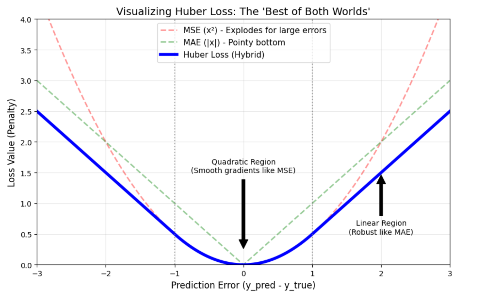

# Section 2.1: Foundations of Modern Architectures

## Overview
Before diving into specialized architectures like CNNs or Transformers, it is critical to master the "Modern Stack" of deep learning. The difference between a toy model and a production-grade model often lies not in the layer count, but in how layers are stabilized and optimized.

## Key Concepts

### 1. The Modern MLP Block
The days of simple `Linear -> Sigmoid` stacks are over. The modern standard for a dense block is designed to prevent vanishing gradients and accelerate convergence.

* **Structure:** `Linear` → `Batch Normalization` → `ReLU` → `Dropout`
* **Why ReLU?** Unlike Sigmoid/Tanh, ReLU does not squash gradients to zero for positive inputs, solving the **Vanishing Gradient** problem in deep networks.

### 2. Regularization & Stability (The "Pro-Training" Suite)
With high-capacity hardware (like A100s) and large parameters, models will memorize data unless constrained, and deep models will fail to converge unless stabilized.

* **Dropout:**
    * **Concept:** Randomly zeroes out neurons during training (e.g., $p=0.5$).
    * **Why:** This forces the network to learn redundant representations. No single neuron can rely solely on a specific neighbor, effectively acting like an ensemble of many smaller networks training simultaneously.

* **Batch Normalization (The "Smart" Normalizer):**
    * **Concept:** Acts as a **Normalizer + Learnable Linear Layer**.
    * **Step 1 (The Safety Mechanism):** Normalizes inputs using the current batch's statistics ($\mu, \sigma$) to have Mean=0 and Var=1. This fixes **Internal Covariate Shift**, preventing gradients from exploding or vanishing in deep networks.
    * **Step 2 (The Fine Tuning):** Applies a learnable scale ($\gamma$) and shift ($\beta$) to the normalized data ($y = \gamma \hat{x} + \beta$). This allows the network to "undo" the normalization if it decides a specific feature needs a different range (e.g., shifting the mean to 5) to be effective.
    * **Bonus:** Because batch statistics are noisy approximations of the whole dataset, it introduces slight noise that acts as mild regularization.
    * https://docs.pytorch.org/docs/stable/generated/torch.nn.BatchNorm1d.html

### 3. Optimization Strategy
* **Adam vs. SGD:**
    * **Adam:** Adaptive learning rates + Momentum. Fast convergence. Great default ($lr \approx 3e-4$).
    * **SGD:** Can generalize better in some final stages but requires careful tuning.
* **Schedulers:** The Learning Rate should not be static.
    * **Warmup:** Start low to stabilize early weights.
    * **Decay:** Lower LR over time to settle into the local minimum.

### 4. Loss Functions (The "Teacher")
Choosing the right loss function is critical. In modern PyTorch, we prefer functions that take **raw logits** (unbounded scores) rather than probabilities for numerical stability.

#### A. Classification (Categorical)

**1. `nn.CrossEntropyLoss` (Multi-Class)**
* **Context:** Classifying an image into one of many mutually exclusive classes (e.g., CIFAR-100).
* **Input (`y_pred`):** `(Batch, Num_Classes)`. Raw Logits (**No Softmax**). `float32`.
* **Target (`y_true`):** `(Batch)`. Class **Indices** (e.g., `5`). `long/int64`.

**2. `nn.BCEWithLogitsLoss` (Binary)**
* **Context:** "Yes/No" tasks (e.g., IMDB Sentiment).
* **Input (`y_pred`):** `(Batch, 1)`. Raw Logits (**No Sigmoid**). `float32`.
* **Target (`y_true`):** `(Batch, 1)`. Binary labels (`0.0` or `1.0`). **Must be `float32`**.

#### B. Regression (Predicting Continuous Numbers)

**1. `nn.MSELoss` (Mean Squared Error)**
* **Context:** The default for most regression tasks (e.g., predicting house prices, coordinates).
* **Formula:** $\frac{1}{N}\sum(y_{pred} - y_{true})^2$
* **Behavior:** Penalizes **large errors** heavily. If the prediction is off by 10, the penalty is 100.
* **Input (`y_pred`):**
    * **Shape:** `(Batch, Output_Dim)` (usually `Output_Dim` is 1).
    * **Type:** `float32`.
* **Target (`y_true`):**
    * **Shape:** Must match Input exactly `(Batch, Output_Dim)`.
    * **Type:** `float32` (**Critical:** Targets must be floats, not integers).

**2. `nn.L1Loss` (Mean Absolute Error)**
* **Context:** When your data has **outliers** or noise.
* **Formula:** $\frac{1}{N}\sum|y_{pred} - y_{true}|$
* **Behavior:** Penalizes linearly. Being off by 10 is just 10x worse than being off by 1. It is more robust to anomalies than MSE.
* **Input/Target:** Same as MSE (matching shapes, `float32`).

**3. `nn.HuberLoss` (Smooth L1)**
* **Context:** The "Best of Both Worlds".
* **Behavior:** Acts like **MSE** when the error is small (for smooth convergence) and **L1** when the error is large (to ignore outliers).
* **Input/Target:** Same as MSE.



```python

import torch
import torch.nn as nn
import torch.optim as optim

class ModernMLP(nn.Module):
    """
    A 'Pro' implementation of a Multi-Layer Perceptron.
    Includes Batch Normalization for stability and Dropout for regularization.
    """
    def __init__(self, input_dim, hidden_dim, output_dim, dropout_rate=0.5):
        super(ModernMLP, self).__init__()
        
        self.net = nn.Sequential(
            # --- Layer 1: The 'Modern' Block ---
            nn.Linear(input_dim, hidden_dim),
            
            # 1. Batch Norm: Stabilizes learning, allows higher LR
            nn.BatchNorm1d(hidden_dim),
            
            # 2. ReLU: Prevents vanishing gradients
            nn.ReLU(),
            
            # 3. Dropout: Forces redundancy (regularization)
            nn.Dropout(dropout_rate),
            
            # --- Layer 2: Output ---
            nn.Linear(hidden_dim, output_dim)
        )
        
    def forward(self, x):
        return self.net(x)

# --- Configuration for "Crazy" Projects ---
INPUT_DIM = 100
HIDDEN_DIM = 1024  # Wide layer suitable for GPU parallelization
OUTPUT_DIM = 10
BATCH_SIZE = 64

# 1. Initialize Model
model = ModernMLP(INPUT_DIM, HIDDEN_DIM, OUTPUT_DIM)

# Move to GPU if available (A100 prep)
device = torch.device("cuda" if torch.cuda.is_available() else "cpu")
model.to(device)

# 2. Optimizer: Adam is the standard starting point
optimizer = optim.Adam(model.parameters(), lr=0.001)

# 3. Scheduler: Decays the LR by 10% every 5 epochs
scheduler = optim.lr_scheduler.StepLR(optimizer, step_size=5, gamma=0.9)

print(f"Model Architecture:\n{model}")
print("-" * 30)

# --- Dummy Training Loop to demonstrate Scheduler ---
print("Simulating Training...")
dummy_input = torch.randn(BATCH_SIZE, INPUT_DIM).to(device)

for epoch in range(1, 11):
    # Forward pass
    optimizer.zero_grad()
    output = model(dummy_input)
    loss = output.sum() # Dummy loss
    loss.backward()
    optimizer.step()
    
    # Update Learning Rate
    current_lr = scheduler.get_last_lr()[0]
    scheduler.step()
    
    print(f"Epoch {epoch} | Loss: {loss.item():.4f} | LR: {current_lr:.6f}")
```

### 5. Data Pipeline Strategy: "Inventory & Logistics"

To ensure scalable and efficient training, the data pipeline is decoupled into two distinct components: **Storage (`Dataset`)** and **Logistics (`DataLoader`)**. This separation of concerns is critical for preventing "Starving GPU" scenarios.

#### A. The Dataset (The "Inventory")
The `Dataset` class is responsible for abstracting the raw data source. It answers two questions: *"How many items do we have?"* and *"Get me item X."*

For this project, we utilize a **Map-Style Dataset**, but we also consider future scalability for larger datasets (like ImageNet).

| Type | Class | Description | Use Case |
| :--- | :--- | :--- | :--- |
| **Map-Style** | `torch.utils.data.Dataset` | Implements `__getitem__` (Random Access). We load the Parquet dataframe into RAM and access rows by index (e.g., "Row 900"). | **CIFAR-100 (Current).** Best when data fits in memory or supports fast random seeks. |
| **Iterable-Style** | `torch.utils.data.IterableDataset` | Implements `__iter__` (Sequential Stream). Reads data like a conveyor belt (e.g., from network streams or TB-scale files) without random access. | **ImageNet (Future Goal).** Essential for handling Terabyte-scale datasets that cannot fit in RAM. |

**Current Implementation:**
* **Source:** Parquet files (Column-oriented storage).
* **Decoding:** JIT (Just-In-Time) decoding of PNG bytes to Tensors using `torchvision.io`.
* **Normalization:** $0-255 \rightarrow 0.0-1.0$.

#### B. The DataLoader (The "Logistics Manager")
The `DataLoader` wraps the Dataset to handle the delivery of data to the GPU. It does **not** read files itself; it manages the delivery:

* **Batching:** Stacks individual samples into tensors of shape `(Batch_Size, Input_Dim)`.
    * *Note:* Even with `batch_size=1`, PyTorch maintains the batch dimension: `(1, 3072)`.
* **Parallelism (`num_workers`):** Spawns multiple CPU subprocesses to pre-load and decode data in the background.
* **Shuffling:** Randomizes indices to stabilize gradient descent.

---

### 6. Normalization Strategies: "Stabilizing the Signal"

Normalization is essential in deep networks to prevent "Internal Covariate Shift"—where the distribution of layer inputs changes constantly during training. It keeps activations within a healthy range (preventing vanishing/exploding gradients).

#### A. Batch Normalization (Vertical)
"Batch Norm" normalizes activations **across the Batch dimension**. It forces neurons to have a standard mean/variance based on the statistics of the entire batch.

* **Behavior:** Dependent on `Batch_Size`. Works best with large batches (e.g., 64+).
* **Training vs. Inference:** Maintains "Running Stats" (mean/var) during training to use later during inference.

**Variants by Dimension:**

| Class | Input Shape | Statistics Scope | Use Case |
| :--- | :--- | :--- | :--- |
| **`nn.BatchNorm1d`** | `(N, C)` <br> *(Batch, Features)* | Calculates Mean/Var for each Feature $C$ across the Batch $N$. | **MLPs**, Fully Connected Layers. |
| **`nn.BatchNorm2d`** | `(N, C, H, W)` <br> *(Batch, Channel, Height, Width)* | Calculates Mean/Var for each Channel $C$ **independently**, aggregating across Batch $N$, Height $H$, and Width $W$. | **CNNs**, Image Data. |
| **`nn.BatchNorm3d`** | `(N, C, D, H, W)` <br> *(Batch, Ch, Depth, H, W)* | Calculates Mean/Var for each Channel $C$ aggregating across Batch $N$, Depth $D$, Height $H$, Width $W$. | **Video** (Time), **Volumetric** (MRI). |

**Clarification on `BatchNorm2d`:**
It computes statistics **per channel**.
* **Global Mean per Channel:** For an RGB image, it learns only 3 distinct pairs of $\mu$ and $\sigma$ (one for Red, one for Green, one for Blue).
* **Translation Invariance:** It aggregates **ALL** pixels $(H, W)$ of the *same color channel* across the entire batch. It does **not** calculate a unique mean for every pixel coordinate (e.g., pixel 0,0 vs pixel 10,10). This ensures the model treats a "red feature" in the top-left corner exactly the same as one in the bottom-right.

#### B. Layer Normalization (Horizontal)
"Layer Norm" normalizes activations **across the Feature dimension** for a **single sample**.

* **Behavior:** Independent of `Batch_Size` (works even with Batch=1).
* **Scope:** Calculates Mean/Var using only the neurons within one specific image/example.
* **Use Case:** Dominant in NLP (Transformers, RNNs) where sequence lengths vary and batch statistics can be noisy.

#### Summary: Which to use?
* **For this MLP Project:** Use **`BatchNorm1d`**. We have flattened vectors (1D features) and a large batch size (1024), which is the ideal environment for Batch Norm.
* **For Future CNNs:** Use **`BatchNorm2d`** to preserve and normalize spatial maps.