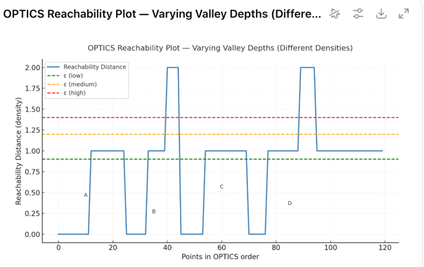

# 📊 Clustering

Clustering is an **unsupervised learning** technique for discovering **natural groupings** in data.  
The goal is to assign each data point to a **cluster** such that:

- Points **within the same cluster** are similar  
- Points **across different clusters** are dissimilar  

There are many ways to define similarity (distance metrics), cluster shapes, and assignment strategies.  
Different methods make different assumptions about what a “cluster” should look like.

---

## 🎯 Why Clustering?

- Explore data structure without labels
- Detect hidden patterns or segmentation
- Identify outliers
- Pre-processing for downstream ML tasks  
  (e.g., topic modeling, semi-supervised learning)

---

## 📌 Core Concepts

| Concept | Meaning |
|--------|---------|
| **Similarity / Distance** | Usually Euclidean, cosine, or statistical distance |
| **Cluster shape** | Spherical? Arbitrary? Based on density or hierarchy |
| **Soft vs Hard assignment** | A point can have one cluster label (hard) or probabilities (soft) |
| **Number of clusters** | Pre-defined (e.g., K-Means) or discovered automatically (e.g., DBSCAN) |
| **Scalability** | Some methods scale well; others are expensive (pairwise distances = $O(n^2)$) |

---

## 🧠 Family of Clustering Algorithms

| Category | Examples | Key Idea |
|---------|----------|---------|
| **Centroid-based** | K-Means, K-Medoids | Assign to nearest cluster center |
| **Density-based** | DBSCAN, HDBSCAN, OPTICS | High-density regions form clusters |
| **Hierarchical** | Agglomerative, BIRCH | Build tree structure of clusters |
| **Graph / Spectral** | Spectral Clustering | Use eigenvectors of similarity graph |
| **Model-based** | GMM | Fit probabilistic models to clusters |

---

## 🔍 Evaluating Clusters

Clustering has **no ground truth**, but metrics help check quality:

- **Internal**: Silhouette score, Davies-Bouldin Index
- **External**: ARI, V-measure (when labels exist)
- **Stability / interpretability** matter as well

---

> ⚠️ Unlike PCA, clustering does **not** produce a projection matrix $W$.  
> Most clustering results **cannot be used to transform new data directly**  
> (unless explicitly model-based like GMM).

---

## 🎯 Centroid-Based Clustering

Centroid-based clustering represents each cluster with a **prototype**:

- Typically a **mean vector** → K-Means
- Or a **real data point** → K-Medoids

Clusters form by assigning each point to the **nearest centroid** based on a distance metric  
(usually **Euclidean distance**).

---

### 🔹 K-Means Clustering

K-Means partitions data into $K$ clusters by minimizing the **within-cluster sum of squared distances** (WCSS):

$$
\min_{C_1, \dots, C_K} \sum_{k=1}^{K} \sum_{x_i \in C_k} \|x_i - \mu_k\|_2^2
$$

Where:
- $C_k$ = cluster $k$
- $\mu_k$ = mean of cluster $k$

---

#### 🧩 Algorithm: Lloyd’s Iteration

1️⃣ **Initialize** $K$ centroids (random or K-Means++)

2️⃣ **Assignment step**  
Assign each point to nearest centroid:
$$
z_i = \arg\min_{k} \|x_i - \mu_k\|_2^2
$$

3️⃣ **Update step**  
Recompute centroids:
$$
\mu_k = \frac{1}{|C_k|} \sum_{x_i \in C_k} x_i
$$

4️⃣ Repeat until convergence  
(e.g., centroids stop changing)

---

#### 🧠 Why this objective?

Squared distance relates to **variance reduction**:

$$
\|x_i - \mu_k\|_2^2 = (x_i - \mu_k)^\top (x_i - \mu_k)
$$

Meaning: K-Means favors **compact, spherical clusters**

---

#### ⚙️ Initialization: K-Means++

To avoid bad local minima:

Probability of choosing next centroid:
$$
P(\mu) \propto D(x)^2
$$

Leads to:
- Better final clusters
- Faster convergence

---

#### 📉 Complexity Notation Explained

| Symbol | Meaning |
|--------|---------|
| $n$ | Number of data points |
| $K$ | Number of clusters |
| $d$ | Dimensionality of each data point (number of features) |
| $T$ | Number of iterations until convergence |

**Why these appear:**

- **Assignment step:**  
  For each of the $n$ points, compute distance to $K$ centroids, each costing $O(d)$  
  ⇒ $O(nKd)$

- **Update step:**  
  Recompute centroids by averaging assigned points  
  ⇒ $O(nd)$

- **Total:** Run for $T$ iterations  
  ⇒ $O(nKdT)$

K-Means is efficient and scales well to large datasets.

---

#### 🧪 Strengths & Weaknesses

| Strengths | Weaknesses |
|----------|------------|
| Fast, scalable | Must choose $K$ beforehand |
| Easy to implement | Sensitive to outliers |
| Works well for large $d$ | Prefers equally sized clusters |
| Interpretable | Fails on non-convex shapes |

---

#### 🌟 Variants

##### **Mini-Batch K-Means**
- Uses **small random subsets (mini-batches)** of data to update centroids
- Reduces computation from full dataset each iteration
- Still approximates standard K-Means objective
- Great for **huge $n$**, streaming data

Key update idea:
- Sample a mini-batch $B$
- Update centroid using only points in $B$ assigned to it

Trade-off:
- Faster convergence ⚡
- Slightly less accurate clusters

---

##### **Kernel K-Means**
- Replace Euclidean distance with a **kernel-based similarity**
- Can cluster **non-linear** structures in an implicit high-dimensional feature space

Distance in feature space:
$$
\|\phi(x_i) - \phi(\mu_k)\|^2
$$

Instead of $\phi(x)$ explicitly, use **kernel trick**:
$$
K(x_i, x_j) = \phi(x_i)^\top \phi(x_j)
$$

This allows:
- Clustering of **complex shapes** (e.g. spirals, moons)
- Without computing coordinates in $\phi$-space

---

##### When to choose these

| Variant | Best for |
|--------|---------|
| Mini-Batch K-Means | Very large datasets, online learning |
| Kernel K-Means | Non-linear cluster boundaries |

---

### 🔹 K-Medoids

Prototype = **real** data point (“medoid”)

Objective:
$$
\min_{C_1, \dots, C_K} \sum_{k=1}^{K} \sum_{x_i \in C_k} \text{dist}(x_i, m_k)
$$

Medoid defined as:
$$
m_k = \arg\min_{x_j \in C_k} \sum_{x_i \in C_k} \text{dist}(x_i, x_j)
$$

Supports **any distance metric** (e.g., Manhattan, DTW, edit distance)

---

#### 🧩 Algorithm: PAM (Partitioning Around Medoids)

PAM iteratively **swaps** medoids with non-medoids to reduce total cost.

Let:
- $M$ = current set of $K$ medoids  
- $C(i)$ = medoid assigned to $x_i$  
- $\text{dist}(x_i, m)$ = distance function  

---

##### **Initialization**
- Select $K$ medoids (randomly or via smarter init like BUILD)

---

##### 🔍 Cost Evaluation for a Swap Candidate

Current total cost:
$$
\text{Cost} = \sum_{i=1}^n \text{dist}(x_i, C(i))
$$

Store:
- $d_1(i)$ → distance to its **current** medoid  
- $d_2(i)$ → distance to its **second** nearest medoid  
- $d_o(i)$ → distance to **candidate** new medoid $o$

Now analyze $x_i$ depending on cluster membership:

---

###### Case 1️⃣: $x_i$ is **not** assigned to $m$

Meaning: **its current medoid is not removed**.

After swap, $x_i$ can either:
- Stay with same medoid → cost stays $d_1(i)$
- Switch to $o$ → cost becomes $d_o(i)$

We always choose the **smaller**:

$$
\text{NewDist}(i) = \min(d_1(i),\, d_o(i))
$$

So the change in cost is:

$$
\Delta_i = \text{NewDist}(i) - d_1(i)
         = \min(d_1(i),\, d_o(i)) - d_1(i)
$$

If $d_o(i) \ge d_1(i)$ → $\Delta_i = 0$ (no change)

---

###### Case 2️⃣: $x_i$ **is** assigned to $m$

Now $m$ is removed, so $x_i$ **must** change medoid.

Two candidates now:
- The **second best** old medoid → $d_2(i)$
- The new candidate medoid → $d_o(i)$

So:

$$
\text{NewDist}(i) = \min(d_2(i),\, d_o(i))
$$

Cost change:

$$
\Delta_i = \text{NewDist}(i) - d_1(i)
         = \min(d_2(i),\, d_o(i)) - d_1(i)
$$

---

Total swap cost change:
$$
\Delta(m, o) = \sum_{i=1}^n \Delta_i
$$

If $\Delta(m, o) < 0$ → accept swap

---

##### **Iterative Improvement (SWAP Phase)**

For **each** $m \in M$  
For **each** non-medoid $o \notin M$:

1️⃣ Compute $\Delta(m,o)$ using rules above  
2️⃣ Select best swap $(m^*, o^*)$ with smallest $\Delta$

---

##### **Perform Best Swap**
If improvement:
$$
\Delta(m^*, o^*) < 0
$$

Then:
- Replace $m^*$ with $o^*$
- **Reassign all points** to nearest medoid:
  $$
  C(i) = \arg\min_{m \in M} \text{dist}(x_i, m)
  $$

Else:
- Stop (local optimum reached)

---

##### 📉 Computational Complexity

- Cost eval per swap:  
  $$O(nK)$$
- Swap candidates:  
  $$O(K(n-K))$$
- Total per iteration:  
  $$O(n^2 K^2)$$

➡️ PAM = **accurate** but **not scalable**

---

#### 🌟 PAM Variants for Speed

| Variant | Key Idea | Benefit | When to Use |
|--------|---------|---------|--------------|
| **CLARA** | Run PAM on **samples** | Approximates PAM efficiently | Very large $n$ |
| **CLARANS** | **Randomized** swap search | Good trade-off speed/quality | Complex large datasets |

---

#### 🧪 Strengths & Weaknesses

| Strengths | Weaknesses |
|----------|------------|
| Robust to outliers | Expensive cost eval ($O(n^2)$ scale) |
| Supports arbitrary metrics | Local optimum risk |
| Better for non-Euclidean data | Slower than K-Means |

---

##### TL;DR

> K-Medoids = robust K-Means  
> PAM = high quality but slow  
> CLARA / CLARANS = scalable approximations

---

#### 🧪 K-Means vs K-Medoids

| Feature | K-Means | K-Medoids |
|--------|---------|-----------|
| Prototype | Mean vector | Real data point |
| Outlier robustness | ❌ Poor | ✔️ Good |
| Distance metric | Mostly Euclidean | Any metric |
| Complexity | Faster | Slower |

---

> 📝 When to use which?
- Use **K-Means** when data is numeric and roughly spherical
- Use **K-Medoids** when data includes **outliers** or **non-Euclidean distances**

---

## 🧱 Density-Based Clustering

Density-based clustering identifies **dense regions** in space as clusters, and regions of **low density** as noise or separation between clusters.

Key ideas:
- No need to specify number of clusters
- Can discover **arbitrarily-shaped** clusters
- Naturally identifies **outliers**

Works well when clusters are detectable by **local point density**.

---

### 🔹 DBSCAN (Density-Based Spatial Clustering of Applications with Noise)

DBSCAN defines clusters by **density reachability** using two parameters:

| Parameter | Meaning |
|----------|---------|
| $\varepsilon$ (eps) | Neighborhood radius for density |
| $\text{minPts}$ | Minimum # of points to form a dense region |

---

#### 📌 Point Types

Given a point $x_i$:

- **Core Point**  
  - $|\text{Nbr}(x_i, \varepsilon)| \ge \text{minPts}$
  - (dense region → can **expand** a cluster)

- **Border Point**  
  - Not core, but **density-reachable** from at least one core point (can **join** cluster but cannot expand it)

- **Noise / Outlier**  
  - Not density-reachable from any core point (too isolated → no cluster membership)

---

#### 🔁 Definitions of Reachability

- **Directly Density-Reachable**  
  Point $q$ is directly density-reachable from point $p$ if:
  1. $\|q - p\| \le \varepsilon$
  2. $p$ is a **core** point  
     $$
     |\text{Nbr}(p, \varepsilon)| \ge \text{minPts}
     $$

- **Density-Reachable**  
  $q$ is density-reachable from $p$ if there exists a **chain of core points**:
  $$
  p = x_1 \rightarrow x_2 \rightarrow \cdots \rightarrow x_k = q
  $$
  where each step is **directly density-reachable**

- **Density-Connected** 
  $p$ and $q$ are density-connected if:
  $$
  \exists\ \text{core point } o:\ 
  p \text{ is density-reachable from } o
  \ \wedge\
  q \text{ is density-reachable from } o
  $$

➡️ A **cluster** is the **maximal** set of points that are density-connected.

---

#### 🧩 Algorithm Steps

For each unvisited point $x$:

1️⃣ Mark $x$ as visited  
2️⃣ Find neighbors within $\varepsilon$:  
   $$
   N(x) = \{x_j : \|x_j - x\| \le \varepsilon\}
   $$
3️⃣ If $|N(x)| < \text{minPts}$ → mark as **noise** (may change later)

4️⃣ Else (core point):  
   - Start a new cluster
   - Recursively add all density-reachable points

Clusters grow **only through core points**  
→ border points **join but never expand** cluster

---

#### 🧠 Intuition

| Idea | Meaning |
|------|--------|
| Dense group of points = cluster | High local point count |
| Sparse region = boundary | Low-density separation |
| Noise = isolated points | Too few neighbors |

---

#### 🧪 Strengths & Weaknesses

| Strengths | Weaknesses |
|----------|------------|
| Finds arbitrary shapes (e.g., crescents) | Choosing $\varepsilon$ is tricky |
| Automatic #clusters | Struggles with varying densities |
| Can mark noise points separately | Sensitive to scale of features |
| Robust to outliers | High-dimensional data → density loss |

---

#### 📉 Complexity

Let $n$ = #points
- Naïve neighbor search: $O(n^2)$  
- With spatial indexing (KD-tree, Ball-tree):  
  $$O(n \log n)$$

Better structure = faster DBSCAN!

---

#### ⚙️ Parameter Selection Tips (with reasoning)

- Choose $\text{minPts} \ge d+1$ where $d$ = feature dimension  
- Use a **$k$-distance plot** (with $k = \text{minPts}$) to pick $\varepsilon$  
- Always **scale / normalize** features before DBSCAN

Below is some reasoning behind these rules of thumb.

---

##### 🧮 Why $\text{minPts} \ge d + 1$?

Geometric / statistical intuition:

1. **Full-dimensional “local blob”**

   In $d$ dimensions, you need at least **$d+1$ points** to form a non-degenerate simplex (e.g.:
   - 1D: 2 points define a segment  
   - 2D: 3 points define a triangle  
   - 3D: 4 points define a tetrahedron  

   Requiring at least $d+1$ points inside the $\varepsilon$-ball means:
   > “This is not just a random line or edge — it’s a locally *full-dimensional* dense patch.”

2. **Avoiding spurious core points in noise**

   Imagine pure uniform noise in $\mathbb{R}^d$.  
   The expected number of neighbors in a small ball is roughly:
   $$
   \mathbb{E}[\#\text{neighbors}] \approx \lambda \cdot V_d(\varepsilon)
   $$
   where $\lambda$ is point density and $V_d(\varepsilon)$ is the volume of a $d$-dimensional ball.

   If $\text{minPts}$ is too small (e.g. 2 or 3 in high dimension), random fluctuations in noise can easily create **fake “core” points**.  
   Making $\text{minPts} \ge d+1$ makes it harder for pure noise to be considered dense.

3. **Practical heuristics**

   Common practical guidelines:

   - $\text{minPts} \approx d + 1$ is a **lower bound**
   - Often people use:
     $$
     \text{minPts} \in [2d, 4d]
     $$
     for moderate $d$, to be more conservative

   Larger $\text{minPts}$:
   - Makes clusters require more evidence of density  
   - Increases robustness to noise and outliers  
   - But can also **miss small clusters**

---

##### 📈 Why does the $k$-distance plot help choose $\varepsilon$?

Define:
$$
k = \text{minPts}
$$
and for each point $x_i$, compute the distance to its $k$-th nearest neighbor:

$$
\text{kDist}(x_i) = \text{dist to k-th nearest neighbor}
$$

Now:

1. **Sort** these distances in ascending order:
   $$
   \text{kDist}(x_{(1)}) \le \text{kDist}(x_{(2)}) \le \dots \le \text{kDist}(x_{(n)})
   $$

2. **Plot** index vs. $\text{kDist}(x_{(i)})$

What happens:

- Points **deep inside clusters** have many close neighbors →  
  $\text{kDist}(x)$ is **small** and changes slowly → **flat-ish region** of the curve.
- Points in **sparse / boundary / noise regions** need to “reach farther” to find $k$ neighbors →  
  $\text{kDist}(x)$ becomes **large**, and rises sharply → **steep region** of the curve.

So you get something like:

---

#### TL;DR

> Cluster = dense area  
> Noise = low-density separation  
> No need $K$  
> Shapes can be weird 😄

---

### 🔹 HDBSCAN (Hierarchical DBSCAN)

DBSCAN uses **one global density threshold** → struggles when clusters have **different densities**.

HDBSCAN removes this limitation by: 

1️⃣ Exploring **all** density levels (all possible $\varepsilon$ values)  
2️⃣ Building a **density-based cluster tree**  
3️⃣ Selecting **stable** clusters from the tree

➡️ Instead of a single DBSCAN snapshot, it captures **the whole DBSCAN evolution**.

---

#### 📌 Key Concepts

| Concept | Meaning |
|--------|---------|
| $\text{minPts}$ | Only hyperparameter required |
| Mutual Reachability Distance | Smooths density measure |
| Minimum Spanning Tree (MST) | Connects points by density |
| Cluster Tree | Clusters appearing/disappearing as density changes |
| Cluster Stability | Measure of persistence across densities |

No $\varepsilon$ parameter is required 🎉

---

#### 🧮 Mutual Reachability Distance

DBSCAN density is defined by **raw distances** → noisy.

HDBSCAN instead defines:

$$
\text{mrd}(a,b) = \max\big(\text{core\_dist}(a),\ \text{core\_dist}(b),\ d(a,b)\big)
$$

Where:
- $d(a,b)$ = pairwise distance
- $\text{core\_dist}(x)$ = distance to **minPts-th** nearest neighbor

This ensures:
- Better separation between dense and sparse regions
- No edge shrinks too fast when density changes
- This is like distance for closest point is standardised to radius

---

#### 🌳 Build Cluster Hierarchy (Condensed Tree)

1️⃣ Compute **MST** using mutual reachability distances  
2️⃣ Remove edges from largest weight → smallest weight  
   (equivalent to gradually lowering $\varepsilon$)\
3️⃣ Track cluster splits as edges break  
   → forms a **hierarchy** of DBSCAN results

> Each split corresponds to a **DBSCAN result** at a specific $\varepsilon$

---

#### 🧲 Select Clusters by Stability

The **cluster tree** built by HDBSCAN contains all possible density-based clusters across multiple density levels (i.e., as we vary the neighborhood parameter $\varepsilon$).  
However, this tree includes:
- Tiny clusters (few points)
- Temporary clusters (appear briefly)
- Noise fragments (unstable)

To extract meaningful clusters, HDBSCAN introduces the concept of **cluster stability**, which measures how long (in density space) a cluster persists before it dissolves or merges.

$$
\text{Stability}(C) = \int_{\lambda_{\text{birth}}}^{\lambda_{\text{death}}} |C(\lambda)| \, d\lambda
$$

Here:
- $\lambda = \frac{1}{\varepsilon}$ is the **inverse density level** — higher $\lambda$ means higher density (tighter clusters).  
- $|C(\lambda)|$ represents the **number of points belonging to cluster $C$** at a given density level $\lambda$.  
  It captures how large the cluster remains as we move through different density thresholds.

This integral effectively sums how “strongly” the cluster exists across density levels —  
longer-lived and larger clusters have greater stability.

---
Both high -> low $\lambda$ and low ->  high $\lambda$ make sense.

**Cluster Birth ($\lambda_{\text{birth}}$)**  
A cluster is *born* at the density level where it **first appears as a distinct connected component** —  
when a group of points separates from its parent cluster because their mutual density becomes high enough.

**Cluster Death ($\lambda_{\text{death}}$)**  
A cluster *dies* when it **merges into another cluster** (usually a more stable parent)  
or dissolves entirely into noise as density increases.  
In the hierarchy, this corresponds to the level where the cluster’s branch ends or merges with another.

Thus:
- Clusters that persist over a **large range of $\lambda$** (long life) are **stable** → likely real structure.  
- Clusters that appear briefly or contain few points have **low stability** → treated as **noise**.

---

**Cluster Selection Algorithm (Excess of Mass / EOM)**  
Because clusters can exist at multiple hierarchy levels, HDBSCAN needs a way to pick the most representative, non-overlapping set.  
It uses the **Excess of Mass (EOM)** algorithm:

1. Traverse the hierarchy tree.  
2. For each cluster, compare its stability with the *sum of its children’s* stabilities.  
   - If children have higher combined stability → keep the children.  
   - Otherwise → keep the parent.  
3. Continue recursively until a globally stable, non-overlapping clustering remains.

This guarantees that:
- Each point belongs to exactly one cluster, and  
- The final clustering maximizes **total stability** across the hierarchy.

---

**Summary**

| Symbol / Term    | Meaning |
|------------------|----------|
| $\|C(\lambda)\|$ | Number of points in cluster $C$ at density level $\lambda$ |
| $\lambda_{\text{birth}}$, $\lambda_{\text{death}}$ | Levels where cluster appears and disappears (merges or dissolves) |
| **Stability**    | Integral of cluster size over its lifetime in $\lambda$ space |
| **EOM Algorithm** | Selects non-overlapping clusters that maximize total stability |
| **Result**       | Keeps only clusters that persist across density scales → true, stable structures |

---

#### 🧪 Strengths & Weaknesses

| Strengths | Weaknesses |
|----------|------------|
| Handles clusters with **varying densities** | Slightly harder to understand than DBSCAN |
| Automatically determines cluster count | More computationally expensive |
| Outputs both clusters & outliers | Requires constructing MST + cluster tree |
| Very robust to noise | One hyperparameter still matters (minPts) |

---

#### 📉 Complexity

- Using KD-trees + MST optimizations:
  $$
  O(n \log n)
  $$

Scales similarly to optimized DBSCAN.

---

#### TL;DR

> HDBSCAN = DBSCAN across **all** density levels  
> + smart selection of **stable** clusters  
> → A **supercharged** DBSCAN for real-world messy data

---

### 🧮 OPTICS (Ordering Points To Identify the Clustering Structure)

#### 🎯 General Idea

**OPTICS** (Ordering Points To Identify the Clustering Structure) is a **density-based clustering** algorithm in the same family as **DBSCAN** and **HDBSCAN**.  
It removes DBSCAN’s main limitation — the need to pick a *single* global density threshold ($\varepsilon$).

Instead of using one $\varepsilon$, OPTICS explores **all density levels** simultaneously, producing a **reachability plot** that reveals clusters across scales.  
It doesn’t output clusters directly — it outputs an **ordered list of points** that encodes the cluster hierarchy.

---

#### 🧩 1️⃣ Core Concepts

**Core Distance**

For each point $x_i$, the **core distance** is the minimum distance $\varepsilon$ such that $x_i$ has at least *minPts* neighbors within it:

$$
\text{core-dist}(x_i) = \text{distance to its minPts-th nearest neighbor.}
$$

If $x_i$ has fewer than *minPts* neighbors, its core distance is undefined — meaning it’s not dense enough to start a cluster.

---

**Reachability Distance**

The **reachability distance** from a core point $x_i$ to another point $x_j$ is defined as:

$$
\text{reach-dist}(x_i, x_j) = \max(\text{core-dist}(x_i), \text{dist}(x_i, x_j))
$$

This ensures:
- Points within dense regions have small reachability distances.
- Points in sparse regions or near cluster edges have large reachability distances.

---

#### 🧭 2️⃣ The OPTICS Algorithm

1. Choose any unprocessed point $x_i$ and mark it as processed.  
2. Compute its core distance and expand its neighborhood:
   - For each unprocessed neighbor $x_j$, compute $\text{reach-dist}(x_i, x_j)$.
   - Maintain a *priority queue* sorted by current smallest reachability distance.
3. Process the next most reachable point, update its neighbors’ reachability distances.
4. Repeat until all points are processed.

This produces an **ordering of all points** $\{x_1, x_2, \dots, x_n\}$ sorted by density connectivity — the essence of OPTICS.

---

#### 📈 3️⃣ Reachability Plot

OPTICS represents its result as a **reachability plot**, where:
- The x-axis shows the processing order.
- The y-axis shows each point’s reachability distance.

Clusters appear as **valleys** — contiguous low-reachability regions separated by sharp peaks (high reachability).  

- Deep valleys → dense, tight clusters.  
- Shallow valleys → looser clusters.  
- Flat, high areas → noise.

This plot effectively visualizes how DBSCAN clusters evolve as $\varepsilon$ changes.

---

#### 🔍 4️⃣ Extracting Clusters — The ξ (Xi) Method

OPTICS automatically extracts clusters from the **reachability plot** using the **ξ-method** (xi method),  
which detects clusters by analyzing **slope changes** in the reachability curve instead of cutting at a fixed ε level.

- A **steep downward slope** → start (birth) of a cluster, where density rapidly increases.  
- A **flat low valley** → core region of a stable cluster (points close together).  
- A **steep upward slope** → end (death) of a cluster, where density drops again.  
- The parameter **$\xi$** defines *how steep* the slope must be to count as a meaningful transition.

In the plot above:
- **Green ε line (low)** → only the deepest, most compact clusters (B, D) are detected.  
- **Orange ε line (medium)** → shallower valleys (A, C) also become clusters.  
- **Red ε line (high)** → multiple valleys merge into broader, coarser clusters.

Hence, the ξ-method allows OPTICS to **dynamically detect clusters across multiple density levels**,  
unlike DBSCAN’s single fixed ε cut.  
Conceptually, it plays the same role as *birth–death persistence* in HDBSCAN,  
but instead of integrating cluster stability, it directly reads the **geometry of the reachability curve**.

---

#### ⚙️ 5️⃣ Why OPTICS Is More Flexible than DBSCAN

| Property | DBSCAN | OPTICS |
|-----------|---------|--------|
| Density threshold | Fixed $\varepsilon$ | All $\varepsilon$ values considered |
| Output | Flat clusters | Reachability-ordered hierarchy |
| Sensitivity | High (depends on $\varepsilon$) | Low (continuous density view) |
| Cluster extraction | Threshold cut | ξ-method (slope-based) |
| Visualization | None | Reachability plot |

OPTICS thus provides a **continuous view** of clustering structure — capturing **clusters of different densities** in a single run, unlike DBSCAN which requires multiple ε trials.

---

#### ✅ Summary

| Concept | Meaning |
|----------|----------|
| **Core Distance** | Minimum radius for a point to be dense (minPts neighbors) |
| **Reachability Distance** | Adjusted distance capturing local density relationships |
| **Ordering** | Sequence of points by increasing reachability distance |
| **Reachability Plot** | Visual cluster hierarchy showing valleys (dense regions) |
| **ξ-method** | Detects clusters via steep valleys and slopes |
| **Advantage** | Handles varying densities without fixed ε; interpretable via reachability plot |

OPTICS can be viewed as a **continuous-density generalization of DBSCAN**  
and a **simpler, visually interpretable precursor to HDBSCAN**.

---

## 🪜 Hierarchical Clustering

Hierarchical clustering builds a **tree-like structure** of nested clusters, revealing relationships at **multiple scales** — not just a single partitioning.

Two main flavors:
- **Agglomerative** (bottom-up): merge points → form larger clusters
- **Divisive** (top-down): split large cluster → smaller ones  
  (rare in practice)

Outputs:
- **Dendrogram**, where:
  - $y$-axis = merging distance
  - Horizontal cuts give different numbers of clusters

Good when you want to **explore structure** at different granularities.

---

### 🔹 Agglomerative Hierarchical Clustering

Start with each point as its **own cluster** → iteratively merge the two most similar clusters.

---

#### 📌 Linkage (How clusters compare?)

Each linkage defines how to compute distance between clusters:

| Linkage | Distance Definition | Shape Bias | Sensitivity |
|--------|--------------------|------------|-------------|
| **Single** | Closest pair | Chained clusters | Noise sensitive |
| **Complete** | Furthest pair | Compact clusters | More robust |
| **Average** | Mean pairwise distance | Balanced | Good general choice |
| **Ward** | Increase in SSE (variance) | Spherical clusters | Requires Euclidean |

Ward’s method:

Let $C_a$ and $C_b$ be **two clusters** we consider merging:
- $|C_a|$ = number of points in cluster $a$
- $\mu_a$ = centroid of cluster $a$  
  $$
  \mu_a = \frac{1}{|C_a|}\sum_{x \in C_a}x
  $$

Merging cost:
$$
\Delta(C_a, C_b) =
\frac{|C_a|\cdot|C_b|}{|C_a|+|C_b|}
\|\mu_a - \mu_b\|^2
$$

➡️ Prefer merges that **minimize increase in within-cluster variance**  
➡️ Produces **K-Means-like** spherical clustering structure

---

#### 🧩 Algorithm Steps

1️⃣ Start with $n$ clusters (each point alone)  
2️⃣ Compute **distance matrix** between clusters  
3️⃣ Merge two **closest** clusters based on linkage  
4️⃣ Update distance matrix  
5️⃣ Repeat until 1 cluster remaining  
6️⃣ Draw **dendrogram**  

Cost:
- **Naïve**: $O(n^3)$ time, $O(n^2)$ memory  
- With clever data structures (e.g., SLINK for single linkage): faster

---

#### 🧪 Strengths & Weaknesses

| Strengths | Weaknesses |
|----------|------------|
| Can visualize hierarchical relations | Not scalable to large $n$ |
| No need to choose $K$ upfront | O(n²) memory for distances |
| Flexible cluster shapes | Early mistakes are irreversible |

> Once two clusters merge → they **never split** again  
> (greedy algorithm, no backtracking)

---

### 🔹 BIRCH (Balanced Iterative Reducing and Clustering using Hierarchies)

Designed for **large-scale** hierarchical clustering.

Key idea:
- Compress data into **Cluster Feature (CF) tree**
- Offline or incremental updates
- Only cluster **summaries**, not raw points → **massive speed-up**

---

#### 📌 Cluster Feature (CF)

Each leaf entry stores:
- $N$ = number of points
- $LS$ = linear sum of points:
  $$
  LS = \sum_{i=1}^N x_i
  $$
- $SS$ = squared sum of points:
  $$
  SS = \sum_{i=1}^N x_i^2
  $$

Thus centroid:
$$
\mu = \frac{LS}{N}
$$

And radius/variance can be computed **without storing points**.

---

#### 🌳 CF-Tree Properties

- Hierarchical tree like B-Tree
- Controlled by:
  - **Branching factor** $B$
  - **Threshold** $T$ (max cluster diameter for a leaf)

As new points arrive:
- Insert into closest CF entry
- If diameter > $T$ → **split**
- Tree grows **bottom-up** like clustering

Multiple phases:
1. Build CF tree  
2. Compress tree (optional)  
3. Apply **global** clustering on leaf summaries (e.g., Agglomerative)

---

#### 🧪 Strengths & Weaknesses

| Strengths | Weaknesses |
|----------|------------|
| Handles **very large datasets** | Sensitive to threshold parameter |
| Online / streaming capability | Loses accuracy due to compression |
| Fast, memory-efficient | CF tree structure order-dependent |
| Good starting point for refinement | |

> BIRCH compromises exactness for **efficiency + scalability**.

---

#### TL;DR

| Method | Best for |
|--------|----------|
| Agglomerative | Small–medium datasets, want dendrogram |
| BIRCH | Huge datasets, incremental clustering needed |

Hierarchical = **structure discovery**, not just labels.

---

## 🌐 Graph / Spectral Methods

### Spectral Clustering

Spectral clustering groups data based on **connectivity structure**, not raw Euclidean distance.  
It excels at discovering **non-convex** and **manifold-shaped** clusters (e.g., 2-moons).

---

#### 🎯 Core Idea

> Points in the same cluster should remain close **through graph connections**,  
> not necessarily in straight-line distance.

Strong graph connectivity → stay close  
Weak or no connectivity → allowed to separate  
→ This is captured using the **graph Laplacian** eigenvectors

---

#### 🧩 Step-by-Step Algorithm

##### 1️⃣ Build a Similarity Graph

Each data point = a node  
Edge weights = local similarity

Example (Gaussian on k-NN):

$$
w_{ij} = \exp\!\left(-\frac{\|x_i - x_j\|^2}{2\sigma^2}\right)
$$

Produces a sparse, symmetric **affinity matrix** \(W\).

---

##### 2️⃣ Compute the Graph Laplacian

Degree matrix:

$$
D_{ii} = \sum_j w_{ij}
$$

Popular form for spectral clustering:

$$
L_{sym} = D^{-1/2}(D - W)D^{-1/2}
$$

---

##### 3️⃣ Solve the Laplacian Eigenvalue Problem

We want to find a vector \(u\) assigning one value per node such that  
**connected nodes have similar values**.

Formally minimize the smoothness energy:

$$
\min_{u^\top u = 1} \; u^\top L u
$$

Lagrangian:
$$
\mathcal{L}(u, \lambda) = u^\top L u - \lambda(u^\top u - 1)
$$

Taking derivative and setting to zero:

$$
Lu = \lambda u
$$

✔ The optimal solutions are **eigenvectors of \(L\)**  
✔ Eigenvalues tell how smooth/cluster-respecting they are

We take the **first $k$ eigenvectors** (smallest eigenvalues),  
stack them into embedding matrix $U \in \mathbb{R}^{n \times k}$.

Each row $U_i$ = new coordinate of point $i$ in **spectral space**.

**Choose Eigen Values**

Since the smallest eigenvalue of $L$ is always $0$ with a **constant eigenvector**,  
it does not provide any cluster separation information.

So we:
- **skip** the eigenvector for $\lambda_1 = 0$
- use the next eigenvectors with **smallest non-zero eigenvalues**

These eigenvectors:
- vary **smoothly inside** each cluster  
- change **sharply across** weak connections between clusters  
→ exactly revealing the boundaries between clusters

Thus, selecting the first $k$ **non-zero** eigenvectors gives a  
low-dimensional embedding where clusters become **linearly separable**.

---

##### 4️⃣ Cluster in Spectral Space

Apply **k-means** on rows of $U$:

- Smooth variation **within** a cluster
- Sharp jumps **between** clusters

Clusters become linearly separable 👍

---

#### 🤔 Why Laplacian Eigenvectors Reveal Clusters

Quadratic form interpretation:

$$
u^\top L u = \frac{1}{2}\sum_{i,j} w_{ij}(u_i - u_j)^2
$$

Minimize it ⇒  
Connected nodes must stay **similar** in $u$.

Only across weakly connected areas (cluster boundaries) can values differ  
→ **Eigenvectors expose cluster separation directions**

---

#### 🔍 Real Example: Two-Moons Dataset

Raw space:
- Moons overlap in Euclidean distance
- K-means fails

Spectral embedding:
- Connected neighbors keep similar values
- Two moons **pull apart** linearly

Graph connectivity **unwraps** manifolds → blobs in spectral space

---

#### 🧠 Summary Table

| Feature | K-means | Spectral Clustering |
|--------|---------|--------------------|
| Uses Euclidean geometry | ✔️ Only | ❌ |
| Uses graph connectivity | ❌ | ✔️ |
| Handles non-convex shapes | ❌ | ✔️ |
| Needs number of clusters | ✔️ | ✔️ |
| Requires building similarity graph | ❌ | ✔️ |

---

#### 📝 TL;DR

> Spectral clustering solves a relaxed graph-cut optimization.  
> Graph Laplacian eigenvectors provide **optimal cluster-aware coordinates**.  
> Then k-means separates them easily.

---

## 🎯 Model-Based Clustering

Instead of grouping points using distance rules (K-Means) or density reachability (DBSCAN), 
model-based clustering assumes:

> Data is generated from a mixture of underlying **probabilistic distributions**.

Goal: Recover those distributions → cluster assignment emerges naturally.

Most common form: **Gaussian Mixture Models (GMM)**

---

### 🔹 Gaussian Mixture Model (GMM)

Assume each cluster corresponds to a **multivariate Gaussian distribution**.

Probability of a data point $x$:
$$
p(x) = \sum_{k=1}^{K} \pi_k \ \mathcal{N}(x \mid \mu_k, \Sigma_k)
$$

Where each component $k$ has:
- Mixing weight $\pi_k$ (cluster prior)
- Mean $\mu_k$ (like centroid)
- Covariance matrix $\Sigma_k$ (cluster shape + orientation)

---

#### 📌 Why GMM instead of K-Means?

| Feature | K-Means | GMM |
|--------|--------|-----|
| Cluster boundary | Hard | Soft (probabilities) |
| Cluster shape | Spherical only | Elliptical (Σ controls shape) |
| Output | Single label | Posterior distribution over clusters |
| Objective | Minimize SSE | Maximize likelihood |

K-Means = special case of GMM with:
- Equal weights $\pi_k$
- Identity covariance $\Sigma_k = \sigma^2 I$
- Hard assignments

➡️ GMM is strictly **more expressive**.

---

#### 🧮 Soft Cluster Assignment

Posterior responsibility:
$$
\gamma_{ik} = p(z_i = k \mid x_i)
= \frac{\pi_k \ \mathcal{N}(x_i \mid \mu_k, \Sigma_k)}
       {\sum_{j=1}^K \pi_j \ \mathcal{N}(x_i \mid \mu_j, \Sigma_j)}
$$

Interpreted as:
> Probability that point $i$ belongs to cluster $k$

No more “you must pick one cluster”.

---

#### 🔁 EM Algorithm (Expectation-Maximization)

Optimizes parameters to **maximize log-likelihood**:

1️⃣ **E-step**:  
Compute responsibilities $\gamma_{ik}$

2️⃣ **M-step**:  
Update parameters:

Weights:
$$
\pi_k = \frac{1}{n}\sum_{i=1}^n \gamma_{ik}
$$

Means:
$$
\mu_k = \frac{\sum_{i=1}^n \gamma_{ik} x_i}{\sum_{i=1}^n \gamma_{ik}}
$$

Covariance:
$$
\Sigma_k =
\frac{\sum_{i=1}^n \gamma_{ik} (x_i - \mu_k)(x_i - \mu_k)^T}
     {\sum_{i=1}^n \gamma_{ik}}
$$

Repeat E/M until convergence (likelihood stops improving).

---

#### ⚙️ Model Selection

Choosing $K$ via:
- **AIC** (Akaike Information Criterion)
- **BIC** (Bayesian Information Criterion)

Penalize complexity → avoid too many clusters.

---

#### 🧪 Strengths & Weaknesses

| Strengths | Weaknesses |
|----------|------------|
| Flexible cluster shapes | Can get stuck in local optimum |
| Soft assignments | Sensitive to initialization |
| Statistical interpretability | Covariance estimation expensive in high-d |
| Likelihood comparison across models | Assumes Gaussianity |

> If distributions are truly Gaussian → GMM = **optimal** clustering.

---

#### TL;DR

> GMM = K-Means +
> real covariance shapes +
> probabilities instead of hard labels

Great for:
- Elliptical, overlapping clusters
- Probabilistic cluster membership
- Anomaly / responsibility scoring

---

## 🧩 Clustering Algorithm Comparison

| Family | Algorithm | Needs K? | Cluster Shape | Handles Varying Density? | Soft/Hard Labels | Noise Detection | Scalability | Key Weakness |
|--------|-----------|----------|----------------|--------------------------|------------------|----------------|-------------|--------------|
| Centroid-based | **K-Means** | ✔ | Spherical, same size | ❌ | Hard | ❌ | ⭐⭐⭐⭐ Fast | Sensitive to outliers & init |
| Centroid-based | **K-Medoids (PAM)** | ✔ | Arbitrary (via distances) | ❌ | Hard | ❌ | ⭐ Medium/Slow | $O(n^2)$ cost |
| Density-based | **DBSCAN** | ❌ | Arbitrary | ✔ | Hard | ✔ | ⭐⭐⭐ | Single density fails |
| Density-based | **HDBSCAN** | ❌ | Arbitrary | ⭐⭐⭐✔ Best | Hard w/ outlier score | ✔ | ⭐⭐ Medium | More complex & memory cost |
| Hierarchical | **Agglomerative** | ❌ | Depends on linkage | ❌ | Hard | ❌ | ⭐ Low–Med | $O(n^2)$ memory & greedy merges |
| Hierarchical | **BIRCH** | ✔/❌* | Varies (approx) | ❌ | Hard (clusters later) | ❌ | ⭐⭐⭐⭐ Large-scale | Approximation → less accurate |
| Model-based | **GMM** | ✔ | Elliptical (covariance) | ❌ | Soft | ❌ | ⭐⭐ Medium | Assumes Gaussian model |

\* BIRCH may auto-determine structure when followed by a global clustering step (e.g., Agglomerative).

### Strength Summary

| Goal | Best Option |
|------|-------------|
| Arbitrary shapes | DBSCAN / HDBSCAN |
| Varying densities | HDBSCAN |
| Very large datasets | BIRCH / Mini-Batch K-Means |
| Probabilistic assignment | GMM |
| Interpret hierarchies | Agglomerative (dendrogram) |
| Fast clustering | K-Means |
| Robust to outliers | K-Medoids / DBSCAN / HDBSCAN |

- **K-Means**: simple, fast, spherical clusters  
- **K-Medoids**: robust to outliers, more expensive  
- **DBSCAN**: shapes + noise detection but struggles with varying density  
- **HDBSCAN**: best for complex real-world density patterns  
- **Agglomerative**: visual structure via dendrograms  
- **BIRCH**: large-scale hierarchical clustering via compression  
- **GMM**: Gaussian-shaped clusters with soft assignments
