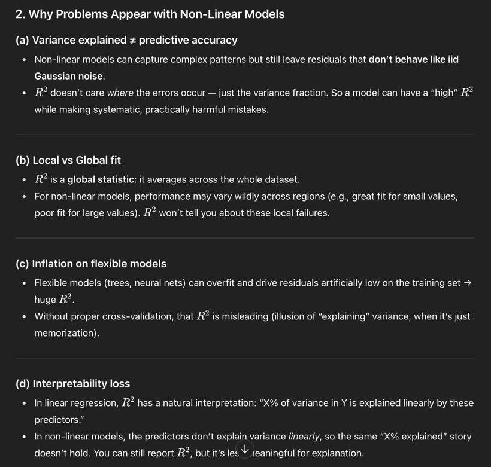

# Linear Models Tricks and Ideas
1. Pipeline + Standard Scaler
2. Check residual against feature/predicted value --> no patter -> linear hypothesis satisfied
3. Better to use learning_curve to avoid lucky split
4. ridge, lasso, linearregression, elasticnet
5. R2, MSE, MAE, RMSE: [LINK](https://farshadabdulazeez.medium.com/essential-regression-evaluation-metrics-mse-rmse-mae-r%C2%B2-and-adjusted-r%C2%B2-0600daa1c03a)
6. 