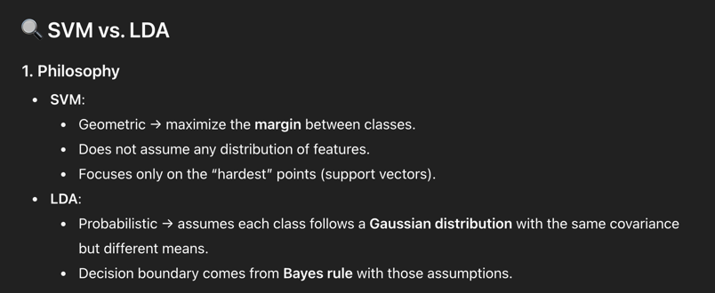

# Support Vector Machine
Refer to: https://scikit-learn.org/stable/modules/svm.html#support-vector-machines

## Basic Idea
Start from binary classification issue. Suppose the class label is (-1, 1)
We want to find a line (a hyperplane) such that all data is at least d away from that.
But we can't in real case, so for those who can't we penalise them, penalise by the distance they have from the hyperplane.
This also means that, if a point is good, and is d away from the right direction of the hyperplane, then it won't get more
reduction on loss. So the loss is:


Note that y here is only +- 1 so, the loss always have correct symbol. Note that this is also a distance, the distance it have
from the hyperplane.

Note that margin are just points that sit on the hyperplane.

The persudo training looks like:
```
Input: Training data {(x1, y1), …, (xn, yn)}, C (regularization), η (learning rate), T (iterations)

Initialize w = 0, b = 0

For t = 1 to T:
    For each training example (xi, yi):
        # Check margin condition
        If yi * (w · xi + b) >= 1:
            # Point is correctly classified & outside margin
            w = w - η * (w)             # only regularization pulls w smaller
        Else:
            # Point is misclassified or within margin
            w = w - η * (w - C * yi * xi)
            b = b + η * C * yi          # adjust bias too

Return w, b
```
So we have `SVC`, `NuSVC` and `LinearSVC`.

Multiclass classification are based on ovr or ovo.

## Probability on top of that
SVC's can also predict probability on classes. It take the output fo SVC scores (i.e. distance from hyperplane). And try to use that
as a 1-d feature and fit an logistic regression:

Since we only have 1 feature, so only param A,B.

## Unbalanced dataset
we can use `class_weight` in class creation, we can also use `sample_weights` during train. In case we really want to make some part right.

## Regression


Same idea for the loss, just regression. And loss across all points.

## One class SVM
The idea is:
- Set a param to penalise weight going too big
- Set all variable to same class

So based on the regularization param, the SVM will decide if it wants to include all or exclude some (if the loss is less than regularisation loss).
Then for whatever other samples, can use the prediction to check if its class 1 normal or class 0 outlier.

For tips, check: 

## Comparison

