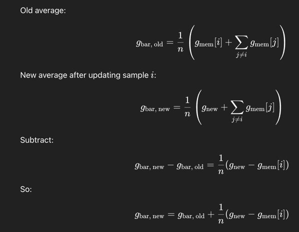

# Stochastic Gradient Descent
This is so efficient, soso efficient, just become popular when now we have massive data.

For reference: https://scikit-learn.org/stable/modules/sgd.html#classification

```
- grad_loss(i, w) => gradient of i-th piece of data in terms of w
- grad_R(w) => regularization loss respect to w
```

## SGD
```
init w
for t = 1..T:
    i ← UniformRandom({1..n})
    g ← grad_loss(i, w) + λ * grad_R(w)          # or prox step if non-smooth
    η ← stepsize(t)                               # e.g., η0 / sqrt(t)
    w ← w - η * g
return w
```

## SAG (Stochastic Average Gradient)
```
init w
for all j: g_mem[j] ← 0
g_bar ← 0                                        # running average of stored grads
for t = 1..T:
    i ← UniformRandom({1..n})
    g_new ← grad_loss(i, w) + λ * grad_R(w)

    # update running average by removing old and adding new
    g_bar ← g_bar + (g_new - g_mem[i]) / n
    g_mem[i] ← g_new

    η ← stepsize(t)
    w ← w - η * g_bar
return w
```
Why g_bar ← g_bar + (g_new - g_mem[i]) / n


## SAGA (SAG + Regularization)
```
init w
for all j: g_mem[j] ← 0
g_bar ← 0
for t = 1..T:
    i ← UniformRandom({1..n})
    g_i ← grad_loss(i, w)                         # current sample gradient (no reg)
    # SAGA direction: use pointwise correction + average of stored grads
    d ← g_i - g_mem[i] + g_bar                    # unbiased VR gradient

    η ← stepsize(t)
    w ← w - η * (d + λ * grad_R(w))               # or: w ← prox_R(w - η * d, ηλ)

    # refresh memory and running average
    g_bar ← g_bar + (g_i - g_mem[i]) / n
    g_mem[i] ← g_i
return w
```

## ASGD
```
init w
w_avg ← 0
for t = 1..T:
    i ← UniformRandom({1..n})
    g ← grad_loss(i, w) + λ * grad_R(w)
    η ← stepsize(t)
    w ← w - η * g

    # running average of parameters (Polyak/Ruppert averaging)
    w_avg ← ((t - 1) * w_avg + w) / t
return w_avg         # often better than returning w
```
Keeps Average everything forward.

## Comparison
https://apxml.com/courses/optimization-techniques-ml/chapter-4-large-scale-ml-optimization/sag-algorithm

## Softmax / Cross Entropy


Cross entropy means more confidence = better