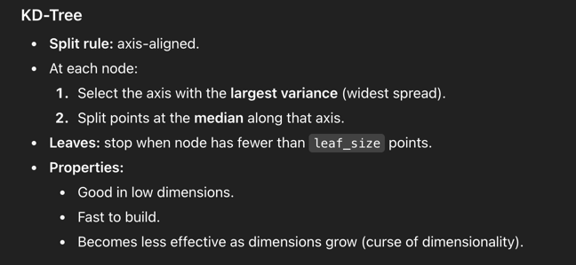
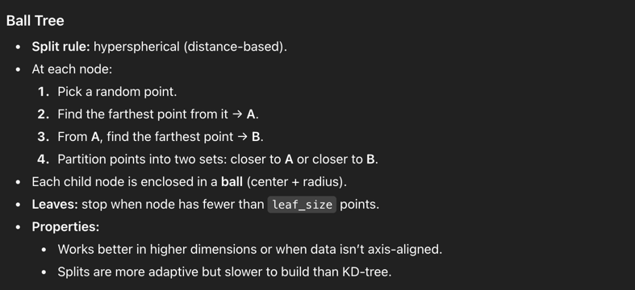
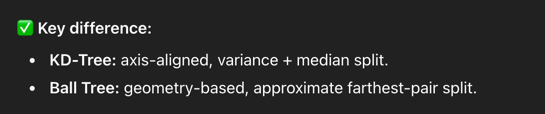
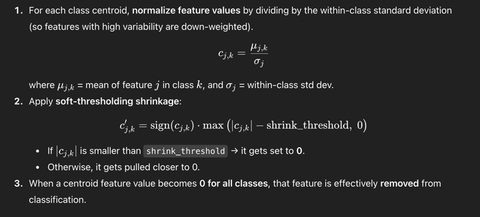
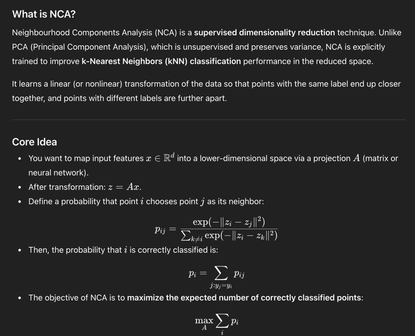
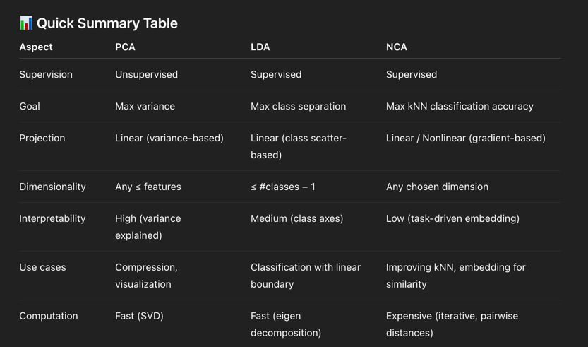

# Nearest Neighbour
Refer to https://scikit-learn.org/stable/modules/neighbors.html

Note that, NN is not K-means, its for finding the nearest neighbour and use that to do classification.
The use of NN can be find similar items, or find clusters etc.

## Algorithms
`['auto', 'ball_tree', 'kd_tree', 'brute']`
- brute: The pair wise brute force algorithm
- ball_tree,kd_tree: https://www.youtube.com/watch?v=FnJj28u7rF0&ab_channel=learndataa




`KDTree` or `BallTree` have their own classes. we can use
```python
from sklearn.neighbors import KDTree
import numpy as np
X = np.array([[-1, -1], [-2, -1], [-3, -2], [1, 1], [2, 1], [3, 2]])
kdt = KDTree(X, leaf_size=30, metric='euclidean')
kdt.query(X, k=2, return_distance=False)
```

## Classification
- `KNeighborsClassifier`: Vote from k neighbours
- `RadiusNeighborsClassifier`: Vote from a certain radius
- `weights = 'uniform'`: Equal vote
- `weights = 'distance'`: Propotional vote

## Regression
- `KNeighborsRegressor`/ `RadiusNeighborsRegressor`
- The idea is that use their y to predict target's y. Weight can be distance or uniform.

## NearestCentroid
Instead of learn a class, given labels, compute mean, kind like k-means.
`shrink_threshold`:


## Transformer
```python
import tempfile
from sklearn.manifold import Isomap
from sklearn.neighbors import KNeighborsTransformer
from sklearn.pipeline import make_pipeline
from sklearn.datasets import make_regression
cache_path = tempfile.gettempdir()  # we use a temporary folder here
X, _ = make_regression(n_samples=50, n_features=25, random_state=0)
estimator = make_pipeline(
    KNeighborsTransformer(mode='distance'),
    Isomap(n_components=3, metric='precomputed'),
    memory=cache_path)
X_embedded = estimator.fit_transform(X)
X_embedded.shape
```
There is also a transformer, which will output sparse metric of distance for each point and the one closest to it.
Which can be passed to other algorithms.

## NCA
 Note this can be applied before others like pre-processing.
