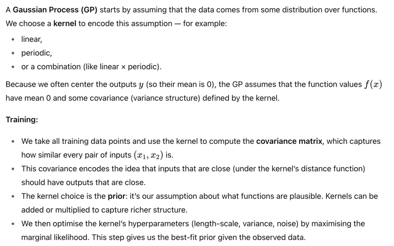
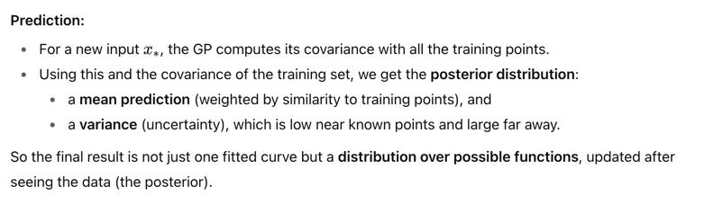
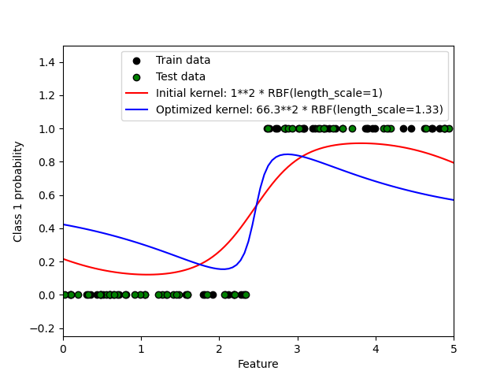

# Gaussian Process
Reference: https://scikit-learn.org/stable/modules/gaussian_process.html

Idea Check: https://www.youtube.com/watch?v=UBDgSHPxVME

## Basic Idea

## Scikit-learn
- `GaussianProcessRegressor` y vote on numbers
- `GaussianProcessClassifier` y vote on classes

