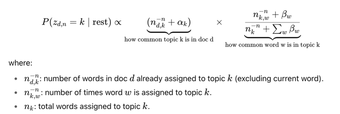

# NLP
References:
- https://scikit-learn.org/stable/modules/feature_extraction.html#text-feature-extraction

Quick Points:
- For NLP, there will usually be sparse matrix, scale based on mean will cause all 0 entry be 0-mean, which will de-densify, divide by std won't.

## Preprocessing
- [CountVectorizer](https://scikit-learn.org/stable/modules/generated/sklearn.feature_extraction.text.CountVectorizer.html#sklearn.feature_extraction.text.CountVectorizer)
  - `token_pattern` is the regex matching (i.e. what is considered a unit of word)
  - stop word happen after preprocessing/tokenization
  - [tf-idf](https://scikit-learn.org/stable/modules/feature_extraction.html#tfidf-term-weighting)
  - [HashVectorizer](https://scikit-learn.org/stable/modules/feature_extraction.html#vectorizing-a-large-text-corpus-with-the-hashing-trick) does not allow backward decode, but since it is hashed, it can compute in parallel and thus faster.
  - preprocessor, tokenizer can be override by passing during construction
  - TfidfVectorizer = CountVectorizer + TfidfTransformer

## Algorithms
- [NMF](https://scikit-learn.org/stable/modules/generated/sklearn.decomposition.NMF.html#nmf)
  - NMF tries to solve: 𝑋 ≈ 𝑊 × 𝐻 with 𝑊, 𝐻 ≥ 0
  - Each row of 𝐻 = weights of words for one topic.
  - Ech rol of W, how each doc is composed of different topic, operate on top of tfidf
- LDA  \n Output each doc as a collection of topic (x% topic A y% topic B) and each topic as a collection of words in dict format.
- Both method need gives ideas around topics, but need to pre-define the topic value
- For feature effect, if things are not scaled, remember to coef * mean(feature) to check sensitivity, use coef * std(feature)