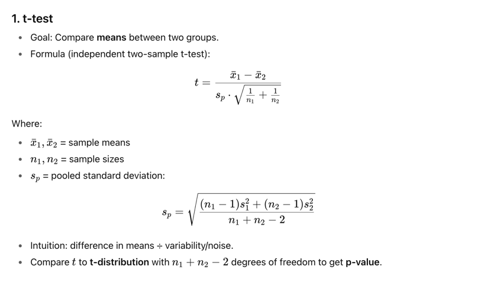
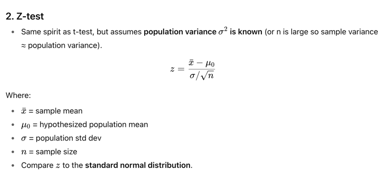
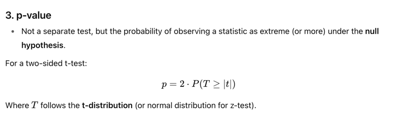
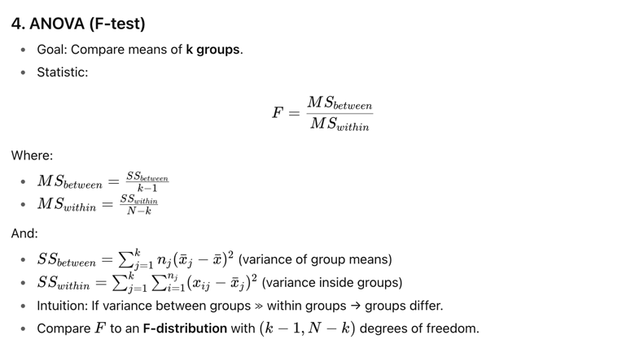
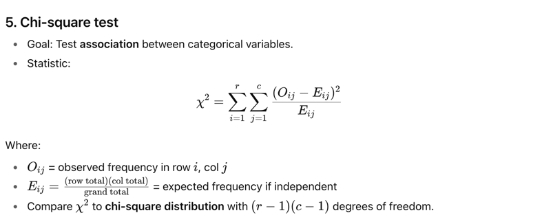
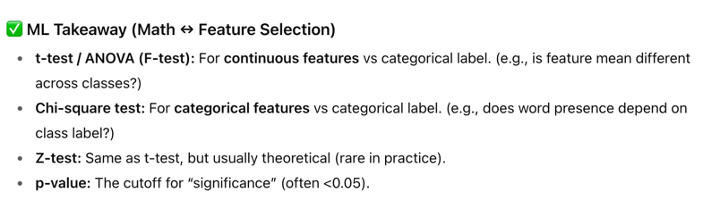

All the following method can be used for feature selection (select top-k, top x quantile) that have
the tio score among whatever we calculate. The idea is that we group feature based on labels.

Note that t/z/p is for binary class, anova/chi-square can be used for any number of groups.

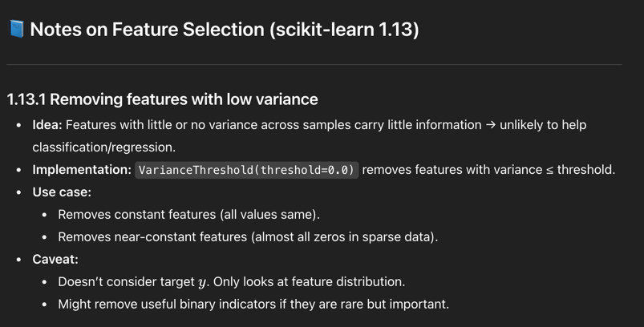
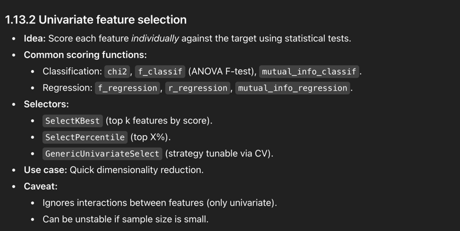
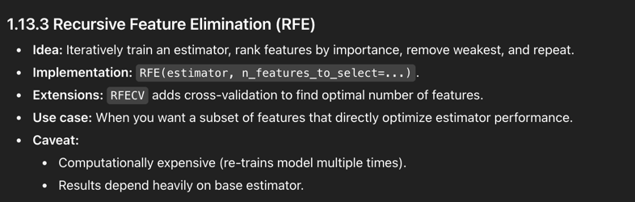
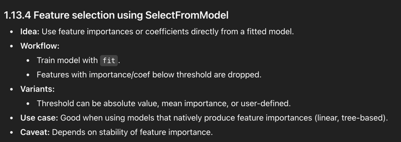
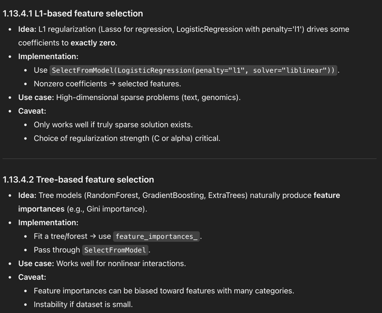
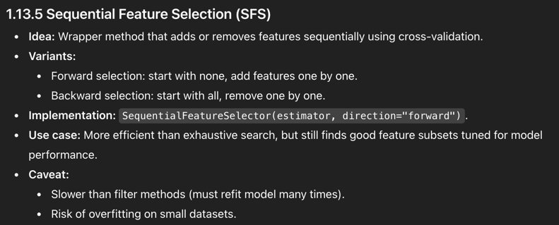
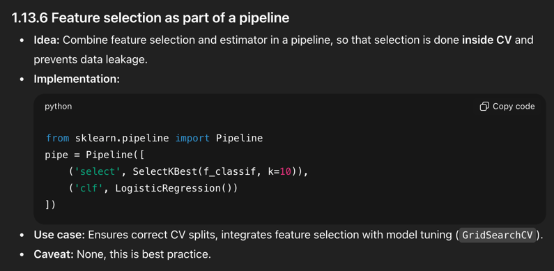